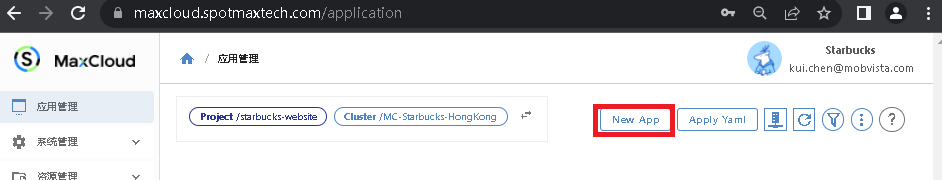
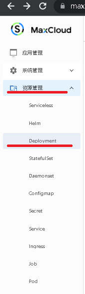
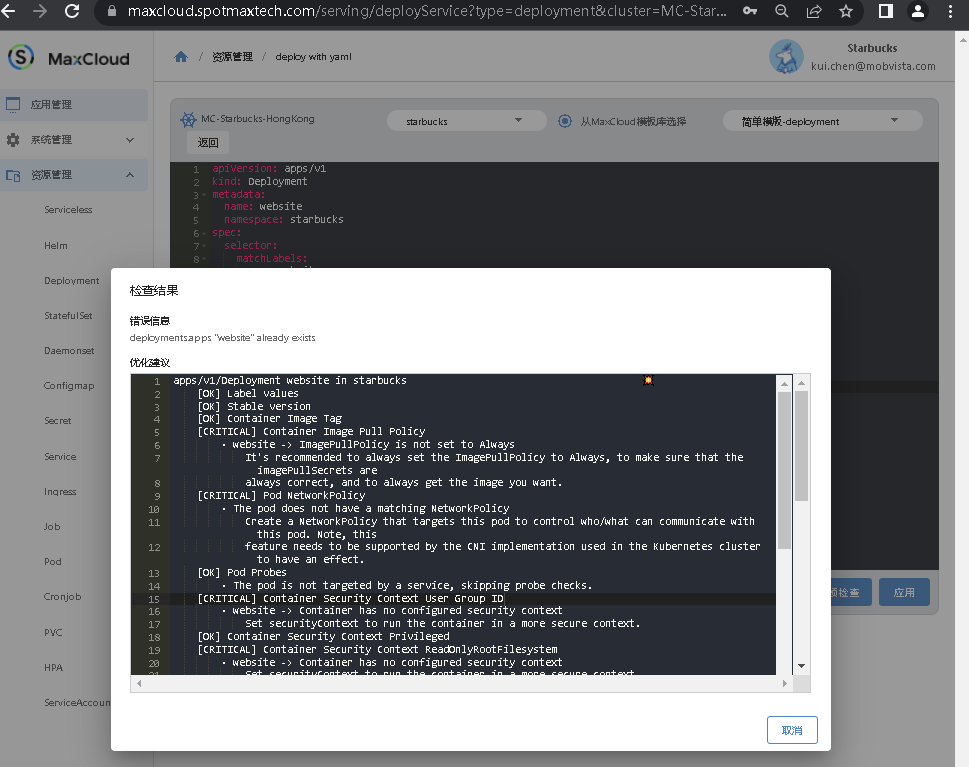

## 创建Bundle starbucks-website以管理我的部署

进入”应用个管理“， 点击 ”New App“



输入相应的设置


点击右下角的按钮

如果已经部署了k8s资源， 可以在创建bundle时， 把相应的资源加入到bundle中进行管理


可以点击查看帮助文档

## 创建相应的k8s部署

为了使Starbucks网站能正常工作， 我们需要

- 创建Deployment启动starbucks的网站镜像
进入 ”资源管理“ ->”Deployment“



点击 "YAML部署"


填入相应的k8s部署文档， 并点击”预检查“

```
# k8s 部署文档示例
apiVersion: apps/v1
kind: Deployment
metadata:
  name: website
  namespace: starbucks
spec:
  selector:
    matchLabels:
      app: website
  template:
    metadata:
      labels:
        app: website
      name: website
    spec:
      containers:
        - image: 'spotmax/starbucks:v0.0.4'
          name: website
          ports:
            - containerPort: 80
              protocol: TCP

```



修复可能的问题后点击 ”应用“， 我们的网站就运行起来了。 

- 创建 Service资源控制负载均衡

进入 ”资源管理“ ->”Service“ 填入k8s service配置，点击 ”应用“

```
apiVersion: v1
kind: Service
metadata:
  name: website
spec:
  externalTrafficPolicy: Cluster
  ports:
      port: 80
      protocol: TCP
      targetPort: 80
  selector:
    app: website
```

- 创建Ingress资源，使用域名访问Starbucks网站

进入 ”资源管理“ ->”Ingress“ 填入k8s ingress配置，点击 ”应用“

```
apiVersion: networking.k8s.io/v1
kind: Ingress
metadata:
  name: starbucks
spec:
  rules:
    - host: starbucks.spotmaxtech.com
      http:
        paths:
          - backend:
              service:
                name: starbucks
                port:
                  number: 80
            path: /
            pathType: Prefix
  tls:
    - hosts:
        - starbucks.spotmaxtech.com
      secretName: spotmaxtech-secret
```

## 把新创建的资源加入到 Starbucks bundle进行管理

进入”应用个管理“， 找到Website bundle 点击 ”Upgrade“


把上面创建的Deployment，Service， Ingress 加入到当前bundle， 并点击”Apply“按钮


点击“Upgrade”按钮， 填入新版本信息，创建新版本来记录当前Deployment和Service等资源的状态。

如果后续发现当前的部署有问题， 可以回滚到前一个版本


## 管理部署

进入”应用个管理“， 找到Website bundle 点击 Website bundle中的“website deployment” （也可以由”资源管理“ ->”Deployment“进入）


在这里可以看到当前Deployment的运行情况， YAML信息， LABELS， 镜像版本， 环境变量， 端口等。


可以在该界面进行以下常用操作：

### 重启Pod


### 调整Pod数量


### 登录到Pod检查配置是否正确


### 删除Pod

当某个特定的Pod出现问题时， 使用“删除”按钮进行删除， ReplicaSet或HPA会重新创建该Pod

### 检查Pod日志


