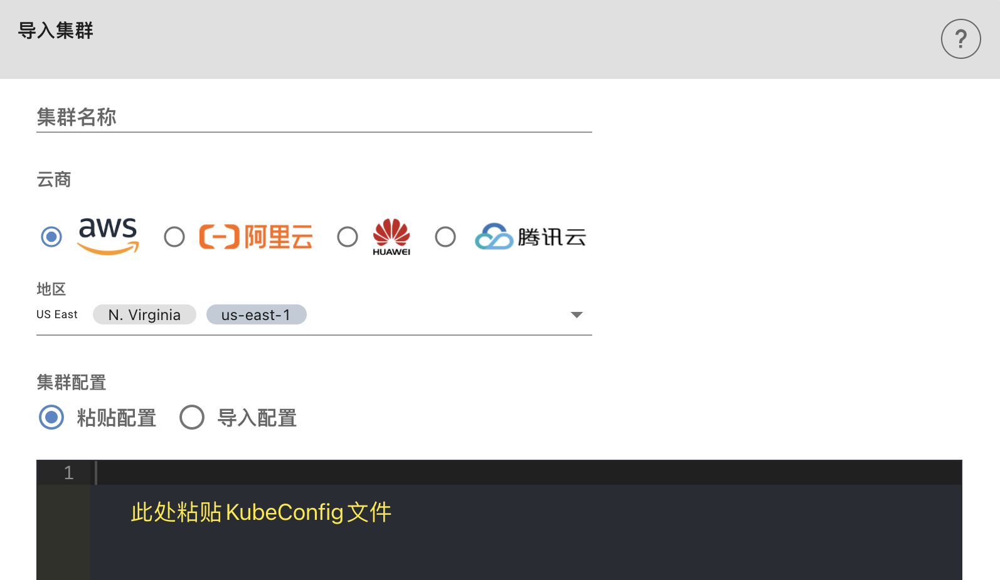

## 🧩 导入集群

### 1：获取k8s集群的config配置

> 不同的云平台操作方式不一样，这里提供比较常用的AWS和阿里云的操作方式。其他云平台请查阅对应平台官方文档，或咨询客服。

#### AWS EKS 获取k8s集群配置

##### 	准备：

- ###### 安装AWS命令行工具

  官网说明文档 ：https://aws.amazon.com/cn/cli/

  windows 环境请按照上面官网说明文档下载最新版本安装

  Mac和Linux安装命令：（要求Python 2.5.6以上版本）

  ```shell
  pip install awscli
  ```

- ###### 安装kubectl

  请选择和集群版本一致的客户端版本，否则可能会出现不兼容的问题

  Kubectl 安装方式请参考下面k8s 官网说明：

  https://kubernetes.io/zh/docs/tasks/tools/

- ###### 获取集群配置信息

  执行下面命令，会在当前文件夹下的config目录中生成k8s集群配置信息config文件。

  ```shell
  # eks 1.23及以下版本
  bash -c "$(curl -s https://raw.githubusercontent.com/spotmaxtech/maxcloud_public/master/setup/aws/aws_token.sh)"
  ```

  ```shell
  # eks 1.24及以上版本
  bash -c "$(curl -s https://raw.githubusercontent.com/spotmaxtech/maxcloud_public/master/setup/aws/aws_token_1.24.sh)"
  ```
  
  > 执行过程中需要输入账号秘钥信息，和集群所在区域、集群名等必要信息。

##### 阿里云ACK获取k8s集群配置

​	阿里云获取集群配置信息比较简单，直接从集群管理信息页面复制即可。


### 2：导入MaxCloud

获取到k8s集群配置信息就可以导入MaxClould了。

登录[MaxCloud平台](https://maxcloud.spotmaxtech.com/)，进入集群管理->集群列表->导入集群

集群名称：填入有意义的信息，方便后续使用过程中区分

云商：选择您集群服务提供商

地区：集群所在地

集群配置信息：填入第一步操作中获取到的集群配置信息


复制上一步操作中获取到的kubeconfig信息到输入框中，或者使用导致配置方式导入配置文件, 用户可以根据需要选择云商及地区，事实上用户只要导入正确的KubeConfig文件，即可直接在MaxCloud平台开始K8s集群的使用




### 3：注意事项

- 请注意检查kubeconfig中的账户验证方式，不能是类似AWS默认命令方式类似

  ```yaml
  users:
  - name: arn:aws:eks:ap-east-1:818539432014:cluster/aws-hk-1
    user:
      exec:
        apiVersion: client.authentication.k8s.io/v1alpha1
        args:
        - --region
        - ap-east-1
        - eks
        - get-token
        - --cluster-name
        - aws-eks-xxxx-1
        command: aws
  ```

  

- 如果您的集群配置了外网访问白名单限制，需要先把下面MaxCloud外网IP添加到安全组中

  ```shell
  47.57.136.45
  47.57.185.152

  # 热备环境IP
  15.152.237.207
  ```

- 不建议使用从rancher等管理软件中导出的kubeconfig文件，可能会有部分权限不足导致问题

