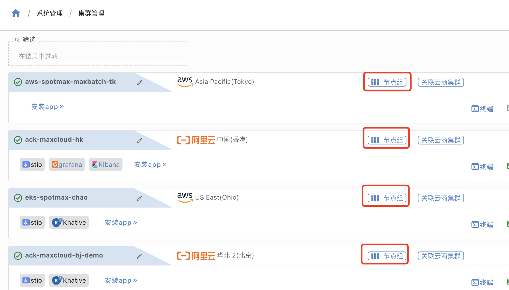
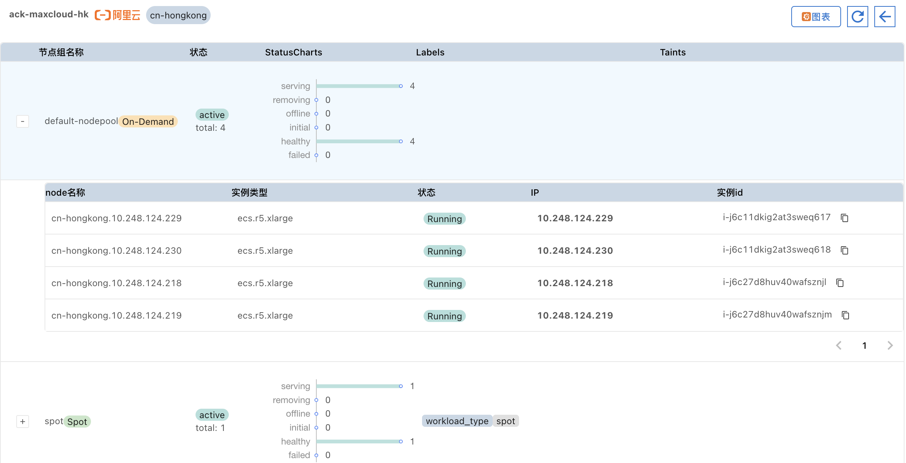
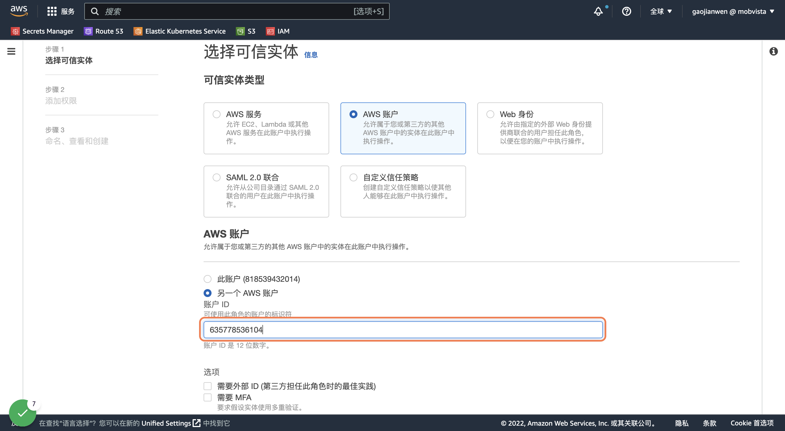
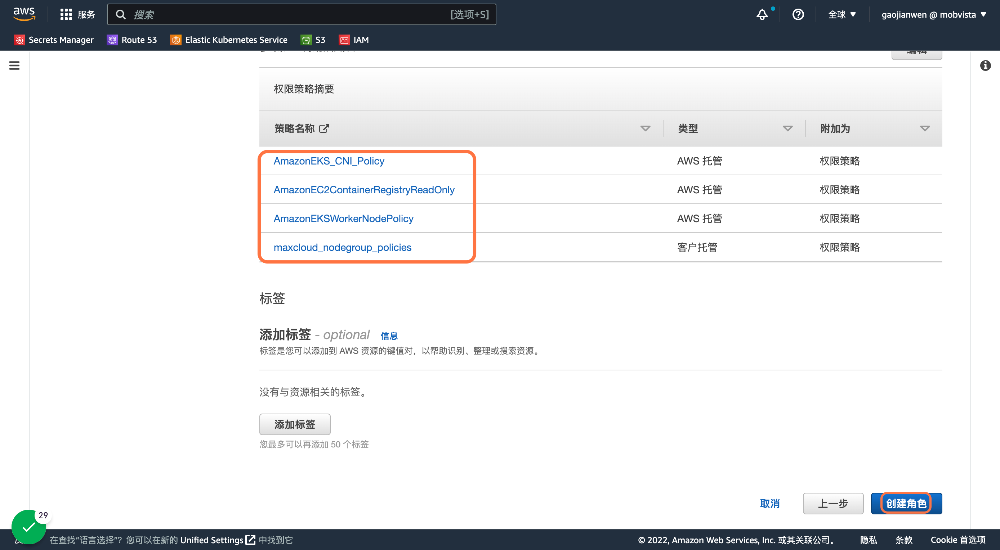
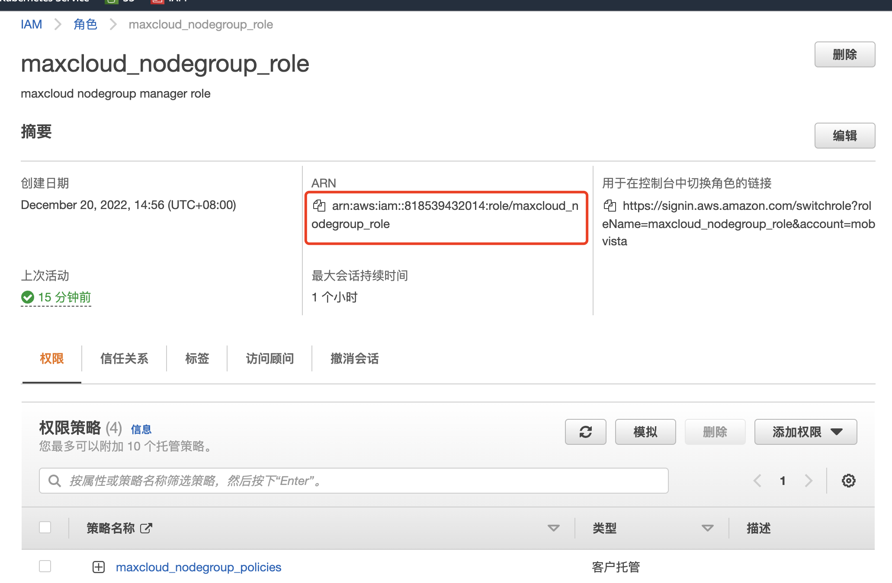
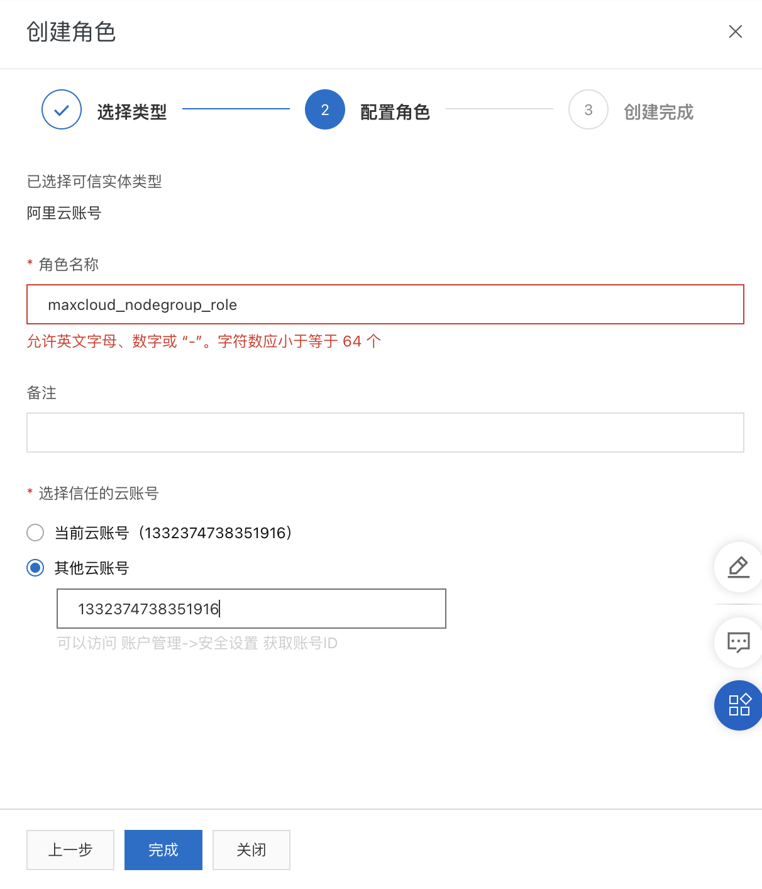
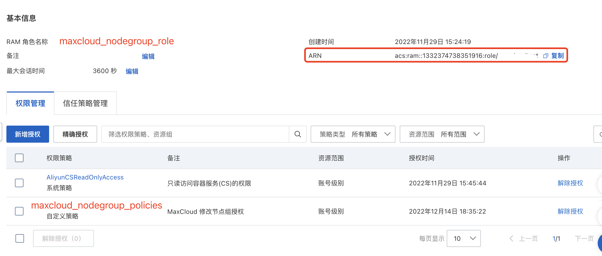
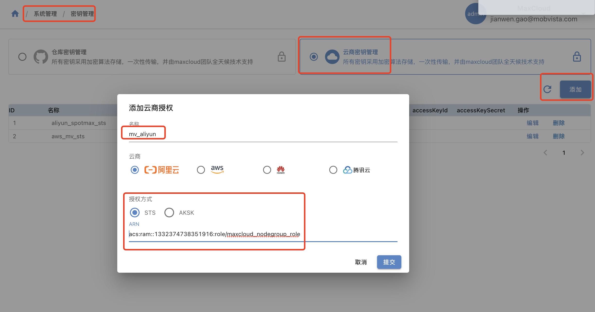
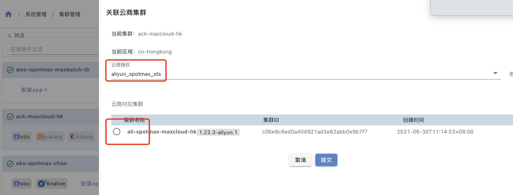
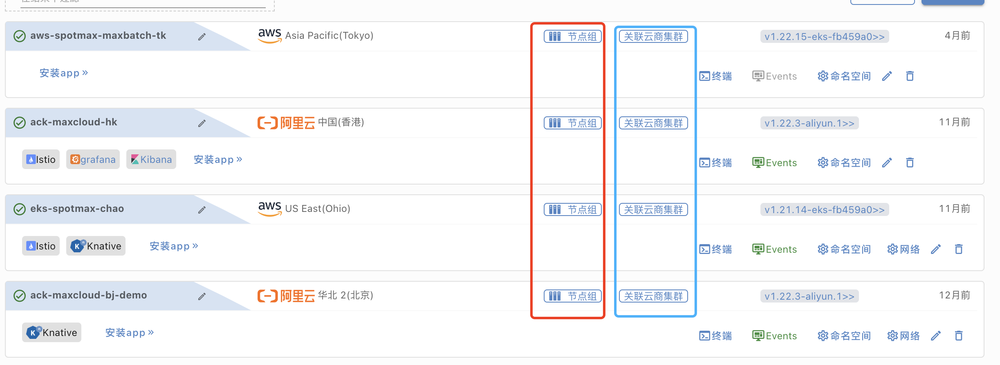

## 集群关联授权

### 查看集群节点组功能示意图

- 进入系统管理->集群管理 点击节点组

  默认没有节点组按钮，需要先点击关联云商集群后才能使用




- 查看节点组和节点组下的节点列表

  

### 配置云商授权

#### aws

1. 创建策略`maxcloud_nodegroup_policies`  填入以下策略

   ```json
   {
       "Version": "2012-10-17",
       "Statement": [
           {
               "Sid": "VisualEditor0",
               "Effect": "Allow",
               "Action": [
                   "eks:DescribeNodegroup",
                   "eks:ListNodegroups",
                   "ec2:DescribeInstances",
                   "autoscaling:DescribeAutoScalingGroups",
                   "eks:UpdateNodegroupConfig",
                   "eks:DescribeCluster",
                   "eks:CreateNodegroup",
                   "eks:ListClusters",
                   "ec2:DescribeSubnets",
                   "eks:TagResource",
                   "iam:PassRole",
                   "iam:GetRole",
                   "iam:ListAttachedRolePolicies",
                   "eks:DeleteNodegroup"
               ],
               "Resource": "*"
           }
       ]
   }
   ```

2. 创建角色，选择可信实体为aws账户`maxcloud_nodegroup_role`、授权给另一个aws账户 ID填写  `635778536104`



3. 关联策略，（第一部创建的策略maxcloud_nodegroup_policies、和其他三个系统策略AmazonEKSWorkerNodePolicy	、AmazonEC2ContainerRegistryReadOnly、AmazonEKS_CNI_Policy）

   

4. 获取Role的ARN `arn:aws:iam::818539432014:role/maxcloud_nodegroup_role`

   

#### 阿里云

1. 创建策略`maxcloud_nodegroup_policies`  填入以下策略

   ```json
   {
       "Version": "1",
       "Statement": [
           {
               "Effect": "Allow",
               "Action": [
                   "cs:ModifyClusterNodePool",
                   "cs:CreateClusterNodePool"
               ],
               "Resource": "*"
           },
           {
               "Effect": "Allow",
               "Action": "vpc:DescribeVSwitchAttributes",
               "Resource": "*"
           }
       ]
   }
   ```

2. 创建角色，选择可信实体为aws账户`maxcloud_nodegroup_role`、授权给另一个aws账户 ID填写  `1332374738351916`



3. 关联策略，（第一部创建的策略maxcloud_nodegroup_policies、AliyunCSReadOnlyAccess）

   

4. 获取Role的ARN `acs:ram::1332374738351916:role/maxcloud_nodegroup_role`

### MaxCloud中添加云商授权



### 集群关联授权

集群管理->关联云商集群



关联成功后就可以再集群页面操作节点组


