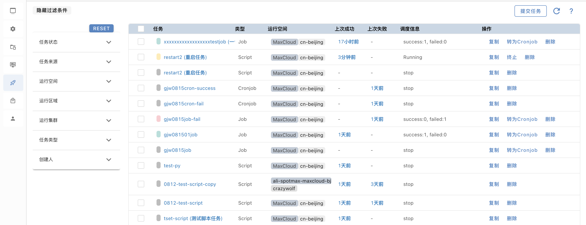
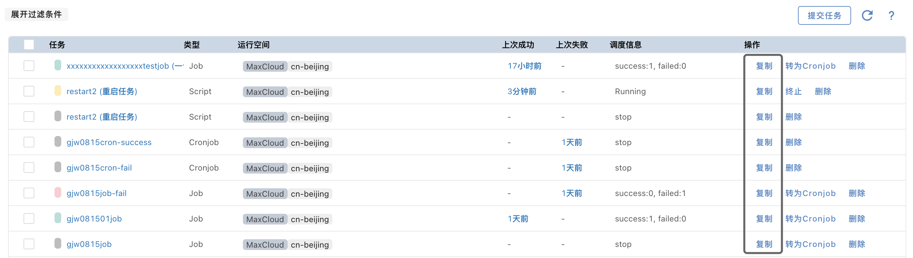
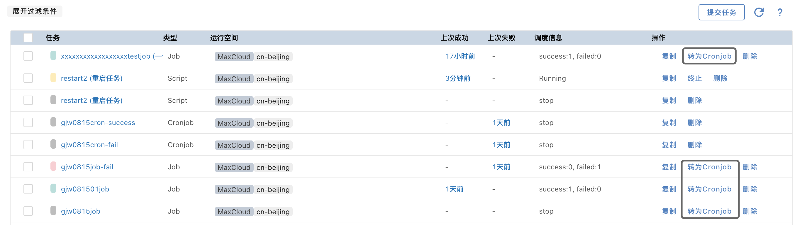
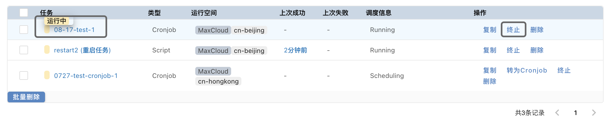
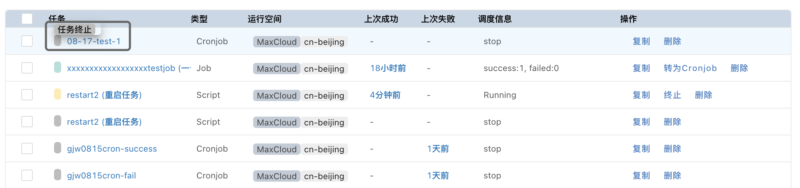
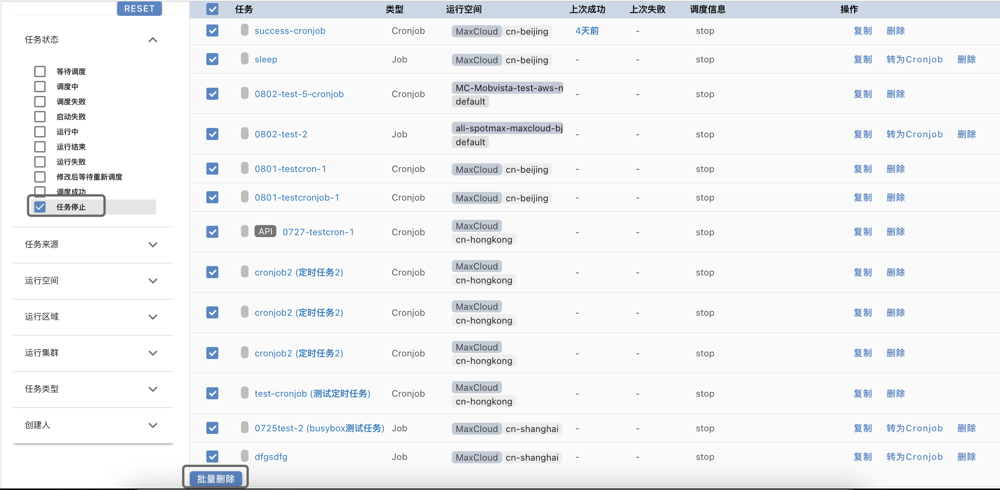

## 任务管理

### 任务查询

在任务列表页面，展示过滤选项即可查询所需任务，Reset可以一键清除过滤条件

### 任务升级/复制

当用户第一次填好任务表单并提交任务后，即完成了任务的”创建“工作。当用户需要对此任务进行升级或再次运行时，用户无需再重复填写表单，MaxCloud提供了**任务复制**功能，用户选择一个任务，并点击**复制**，即可将所选任务的表单项自动填入到表单中，省去了重复填写的繁琐工作。

### Job升级至Cronjob

当用户的一次性任务调试成功，想转为定期执行任务时，MaxCloud提供Job一键升级至Cronjob的操作。在任务列表中，用户点击**转为Cronjob**, 即可将Job也有配置转到Cronjob中，用户只需配置触发周期，即可完成Cronjob任务的创建。

### 任务终止

任务提交完成后，任务会变为”等待调度“的状态，当任务已经开始运行，在任务列表中会显示”运行中“。此时如果用户发现任务运行有问题，是可以随时终止任务的。

在列表中点击”终止“，即可终止正在运行中的任务。

### 任务删除

用户提交的任务有两种删除方式：单条删除和批量删除

当用户想要批量删除已经终止运行的任务时，可以通过状态过滤出已经终止的任务，然后执行批量删除

