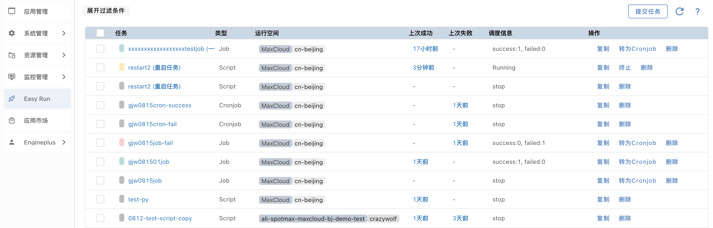
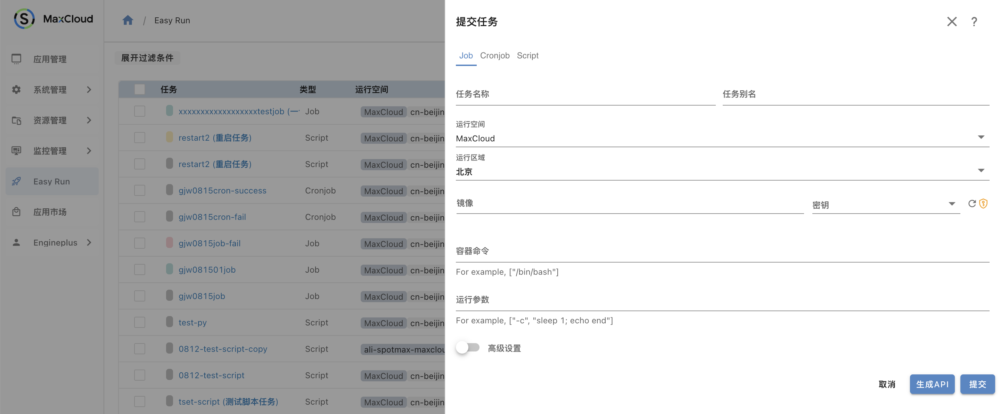
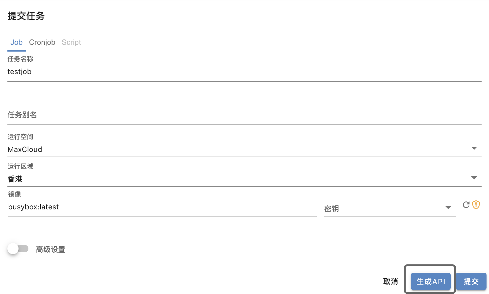
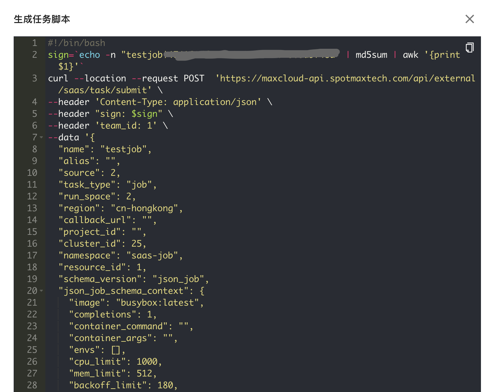

## 快读入门

### 提交任务

点击Easy Run任务列表页的提交任务，打开提交任务表单窗口，当前支持Job和Cronjob类型

#### 表单项介绍

**类型选择**

目前easyrun提供三种任务提交的方式：Job, Cronjob, Script， 用户可根据自己的业务场景选择不同的执行方式

**运行空间**

当前MaxCloud提供两种运行环境：1）MaxCloud运行空间；2）自有集群

如果选择MaxCloud运行空间，用户可以根据自己的实际需求选择不同的Region。此种方式的好处是用户不必维护自己的集群环境，MaxCloud提供的运行环境保证用户能够开箱即用，节省运维成本，提升DevOps效率。

如果用户想要独占集群环境，也可以使用自己已创建好的集群。如果集群已经导入到MaxCloud或者已经在MaxCloud创建完成，则用户可以选择集群和命名空间；如果集群未导入到MaxCloud，或者未在MaxCloud创建完成，则需要用户在集群管理中完成集群的导入或创建。

**镜像和密钥**

用户提交任务，需要指定镜像地址以及密钥，关于密钥，MaxCloud提供密钥管理功能，该密钥只用作拉取镜像使用

**存储选项**

设置StorageClass和MountPath

**容器命令和参数**

当用户选择以脚本形式提交任务时，容器命令为必填项，系统需要根据用户指定的启动命令去运行脚本，例如用户指定容器命令为python，则MaxCloud会执行`python test.py`, 其中test.py是用户指定的脚本名称。

当用户选择以Job或Cronjob提交任务时，也可以指定启动命令和参数，提交的格式可以参考MaxCloud提供的示例

### 运行方式

当前MaxCloud支持两种任务提交方式：1）平台直接提交；2）通过API方式提交

如果用户填写完上述表单后，直接提交任务，即可在任务列表中看到已经提交成功的任务。用户也可以不通过MaxCloud提交任务，通过API的方式，将Job或Cronjob任务放在自己的业务逻辑中，也可以实现任务的提交。

用户填写完表单项，选择生成API，即可看到生成脚本的对话框

