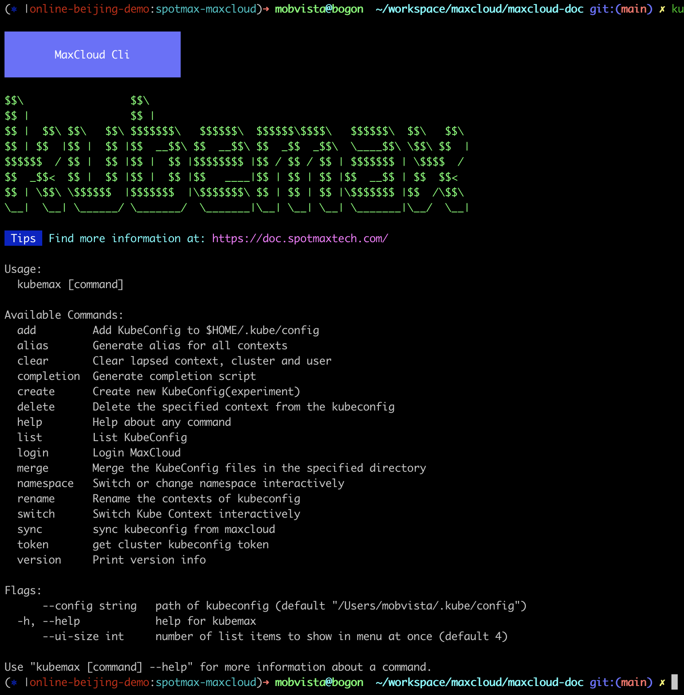
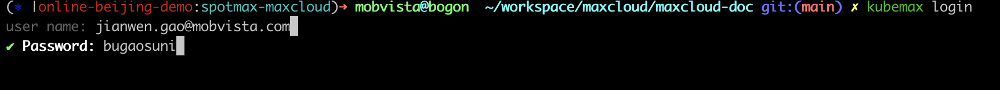
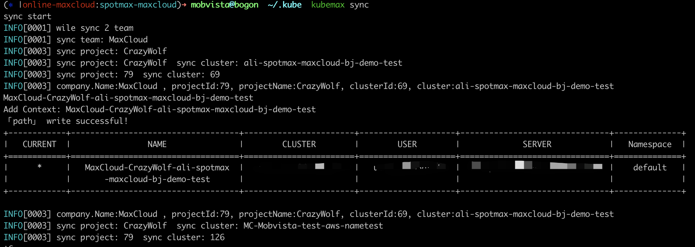

## 🆒 KubeMax 使用介绍

> Kubemax 是MaxCloud 命令行版的客户端，目前主要用于简化用户管理本地kubeconfig

Kubemax 支持在Windows、Linux、macOS等系统中运行，您可以根据实际环境下载和安装合适的版本。

### 版本和运行环境

- 当前版本：v1.1
- 软件源码：[kubemax](https://gitlab.mobvista.com/spotmax/maxcloudcli)
- 运行环境
  - Windows/Linux/macOS
  - 支持架构：x86（32bit、64bit）、ARM（32bit、64bit）

### 下载地址

Kubemax v1.1版本基于Golang 1.18版本编译，

- [MacOs](https://resource.spotmaxtech.com/kubemax/kubemax_macos)
- [Linux](https://resource.spotmaxtech.com/kubemax/kubemax_linux)
- [Windows](https://resource.spotmaxtech.com/kubemax/kubemax_windows.exe)

根据您的操作系统下载对应版本，然后按如下步骤安装并配置kubemax，以下均以64位系统为例。

**按照下文描述下载好kubemax后，需要把文件移动到环境变量里，方便后续再任意目录执行命令**

### Linux系统安装

1. 运行以下命令下载kubemax。

   ```bash
   curl -o kubemax https://resource.spotmaxtech.com/kubemax/kubemax_linux
   ```
2. 运行以下命令修改文件执行权限。

   ```bash
   chmod +x kubemax
   ```
3. 查看是否可以执行，如果能输出帮助信息说明可以使用

   ```bash
   ./kubemax
   ```

### Windows系统安装

1. 单击下载链接下载工具。并修改文件名为kubemax.exe
2. 检查是否可以执行

   ```undefined
   D:\kubemax>kubemax.exe
   ```

### macOS系统安装

1. 运行以下命令下载kubemax。

   ```bash
   curl -o kubemax https://resource.spotmaxtech.com/kubemax/kubemax_macos
   ```
2. 运行以下命令修改文件执行权限。

   ```bash
   chmod +x kubemax
   ```
3. 查看是否可以执行，如果能输出帮助信息说明可以使用。

   ```bash
   ./kubemax
   ```

### 使用帮助

#### 查看帮助

```
kubemax
```



#### 登录MaxCloud

```shel
kubemax login
```



#### 同步您账户下所有集群的kubeconfig

```shell
kubemax sync
```

当然也可以指定团队、项目、集群同步

```shell
1:同步您账号下所有团队、项目、集群
kubemax sync

2:指定团队同步所有项目下的集群
kubemax sync teamName

3:指定团队和项目同步所有集群
kubemax sync teamName projectName

4:同步指定集群
kubemax sync teamName projectName clusterName
```



同步完成后所有MaxCloud账户下的集群kubeconfig都会添加到您本地 config文件中。

---

除 Login 、sync、token三个命令其他命令都是和kubecm 一致，具体使用方式请参考kubecm

#### jsonlog

从MaxCloud网页下载到的容器运行时日志大部分都是Json格式的，很多同学感觉查看不方便，我们增加jsonlog 可以把json日志解析成原始日志

- 为什么MaxCloud查看的日志和下载到的日志格式不一样？
  1：再网页上查看实时日志 是使用 kubectl logs 相同机制获取容器的日志，这个时候看到的日志和程序输出的是一致的。
  2：下载文件时容器终端日志通过Docker 写入到主机磁盘上，json写入日志的格式默认是json格式，如果要修改需要修改集群所有节点的Docker配置，并重启Docker服务，会对业务有一定影响，改为非Json格式，对已有EFK等日志收集工具也需要同步修改。

基于以上原因开发了这个小工具 可以下载后再本地做一次格式转换。

```shell
kubemax jsonlog   jsonLogFileName.log
```

执行上面命令后会生成一个jsonLogFileName_nojson.log 的文件，就是解析好的日志文件

[kubecm Github](https://github.com/sunny0826/kubecm)

[kubecm官网](https://kubecm.cloud/)
