## 快速开始

### 创建团队

初次使用MaxCloud需要先添加团队，登录到MaxCloud之后会来到团队管理页面，在团队管理页面选择“添加团队”

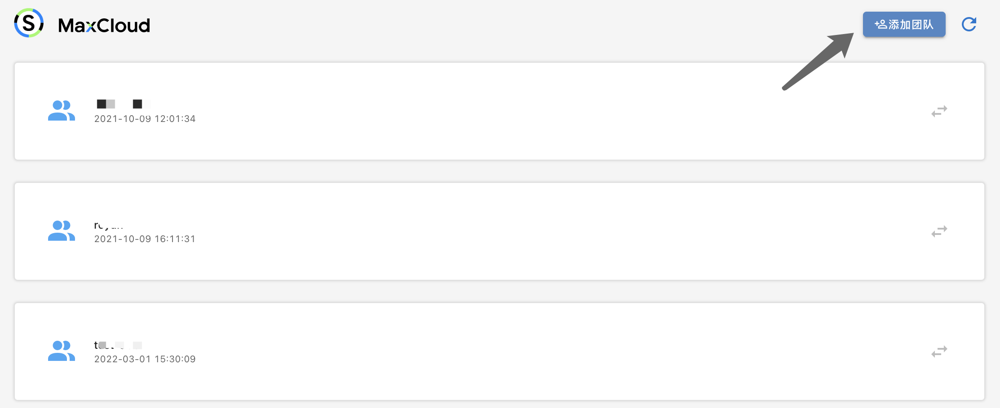

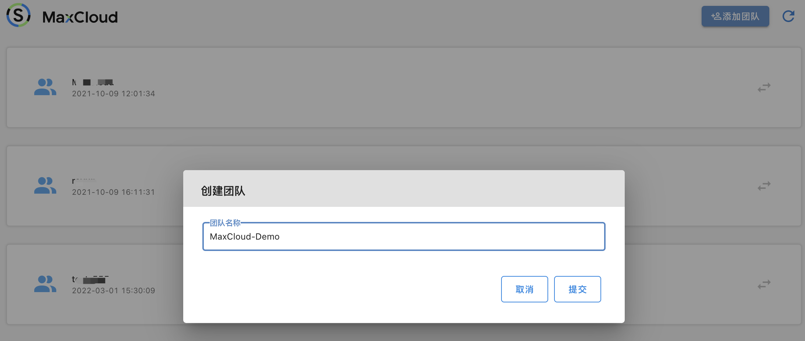

添加完成后，点击MaxCloud-Demo进入到团队空间，此时新创建的团队空间不包含任何项目和集群资源，用户需要先建立一个自己的项目。一个完整项目必备的基础资源包含集群以及集群命名空间，因此在创建项目之前，用户需要先在MaxCloud配置集群，目前支持两种集群的配置方式：导入已有集群和创建新集群，用户可以根据自己的需要配置集群。

### 添加集群

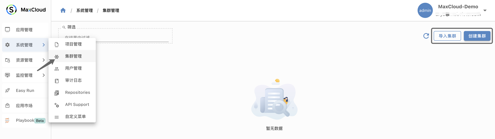

我们以创建集群为例，输入集群名称，选择云商及创建区域，点击”提交“，即可完成集群的创建

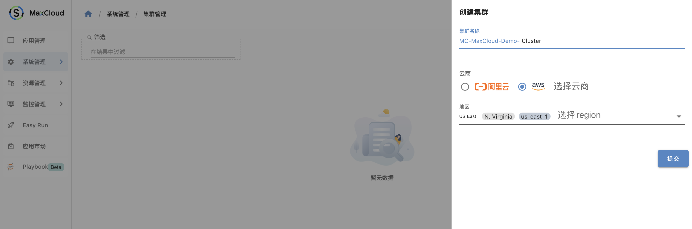

提交之后会来到集群管理页面，此时用户已经可以在集群列表中看到正在创建的集群，创建成功后，集群会变成”可用“状态。

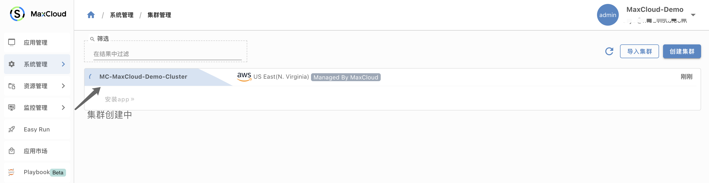

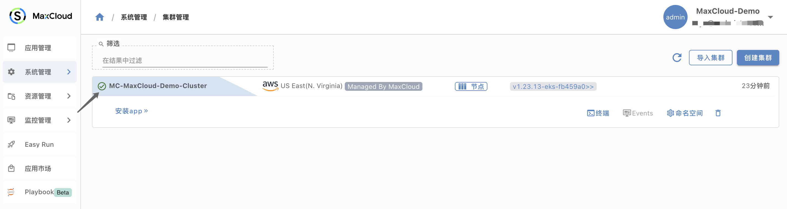

#### 添加命名空间

集群创建成功后，可以直接从MaxCloud平台创建命名空间

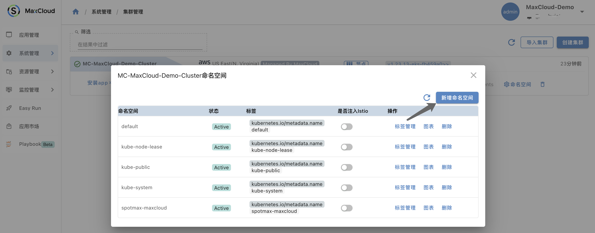

### 创建项目

在系统管理中，选择”项目管理“，创建项目时，可以选择该项目需要关联的集群和集群命名空间，点击提交完成项目的创建。创建成功后，会在项目列表页面中查看到已经创建的项目。

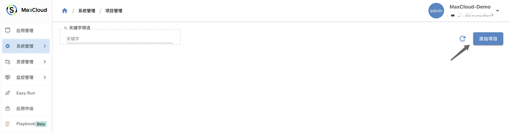

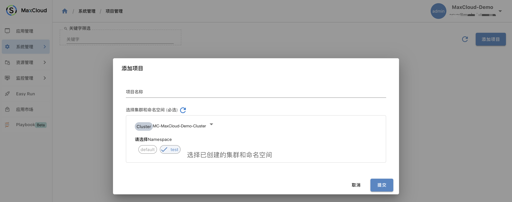

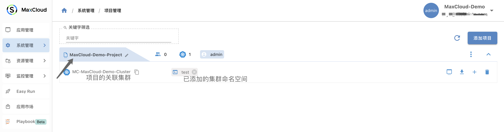

### 创建应用

#### 资源部署

将php-apache.yaml部署到test命名空间，创建deployment和Service

```yaml
apiVersion: apps/v1
kind: Deployment
metadata:
  name: php-apache
spec:
  selector:
    matchLabels:
      run: php-apache
  replicas: 1
  template:
    metadata:
      labels:
        run: php-apache
    spec:
      containers:
      - name: php-apache
        image: registry.k8s.io/hpa-example
        ports:
        - containerPort: 80
        resources:
          limits:
            cpu: 500m
          requests:
            cpu: 200m
---
apiVersion: v1
kind: Service
metadata:
  name: php-apache
  labels:
    run: php-apache
spec:
  ports:
  - port: 80
  selector:
    run: php-apache
```
```bash
deployment.apps/php-apache created
service/php-apache created
```

创建HPA
```bash
kubectl autoscale deployment php-apache --cpu-percent=50 --min=1 --max=10
```

```bash
horizontalpodautoscaler.autoscaling/php-apache autoscaled
```

#### 创建Bundle

在应用管理中，选择”New app“来到应用创建页面，选择”Native Bundle“，同时注意项目-集群-命名空间的选择，输入应用名称和应用描述，版本名称和版本描述。

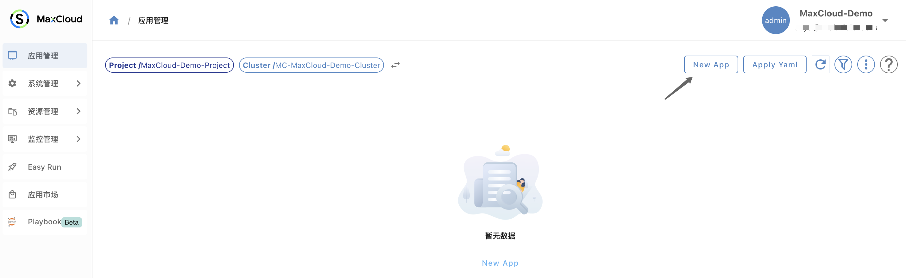

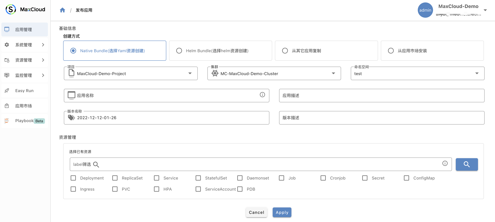

在资源管理中，选择应用包含的资源，当选择某一资源时，MaxCloud会自动推荐关联资源

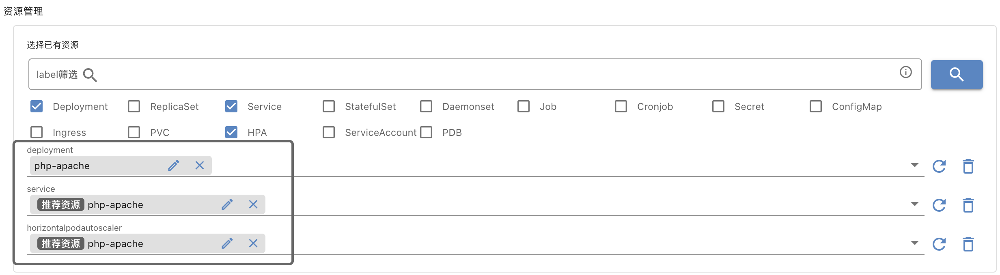

点击Apply，MaxCloud系统会执行Dry Run，进行资源检查，当检查通过后，点击提交即可完成应用的创建。

在应用管理页面，用户可以看到已经创建完成的Bundle，点击资源链接，即可看到资源详情。

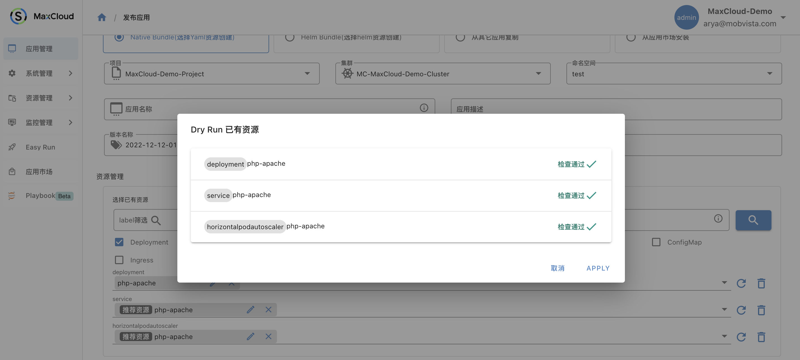

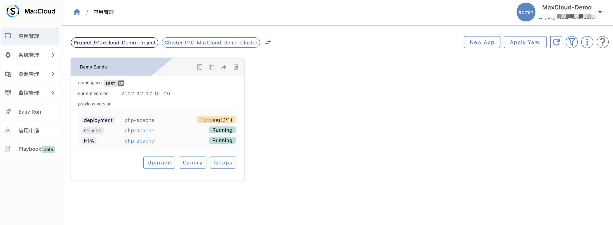

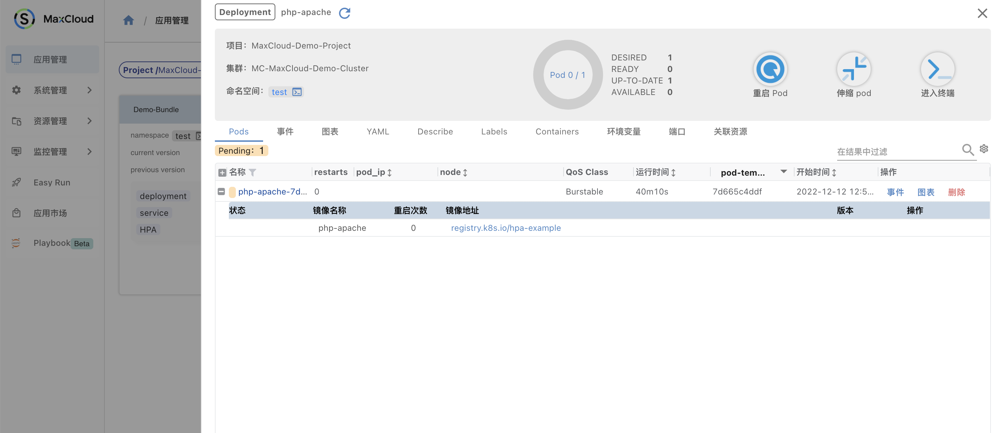

