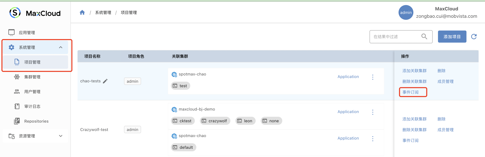
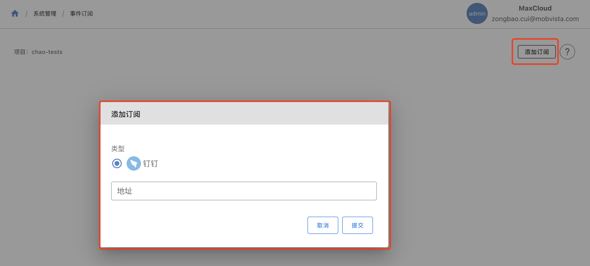
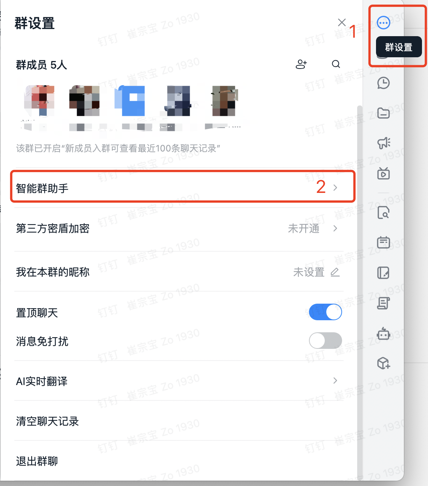
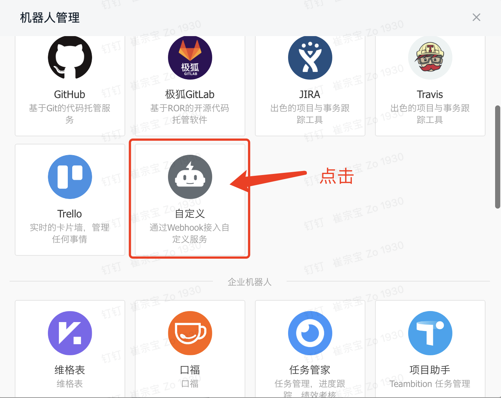
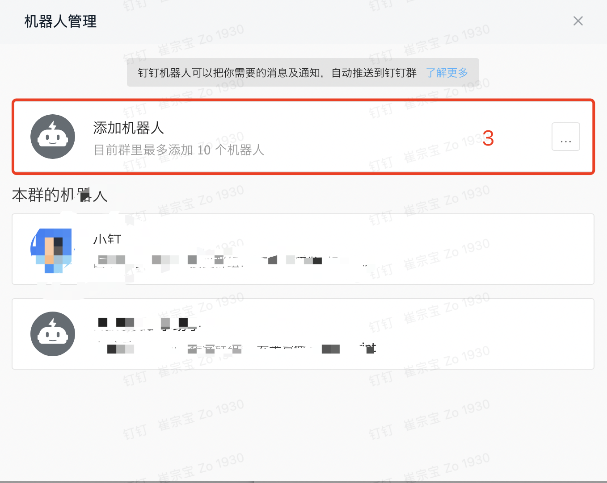
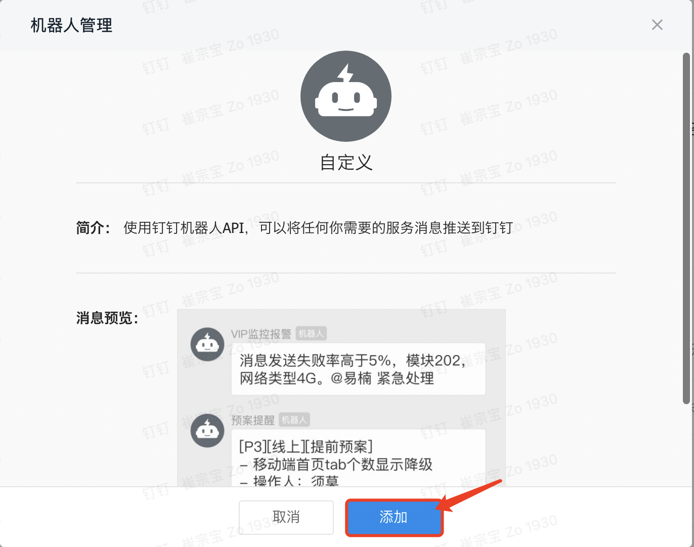
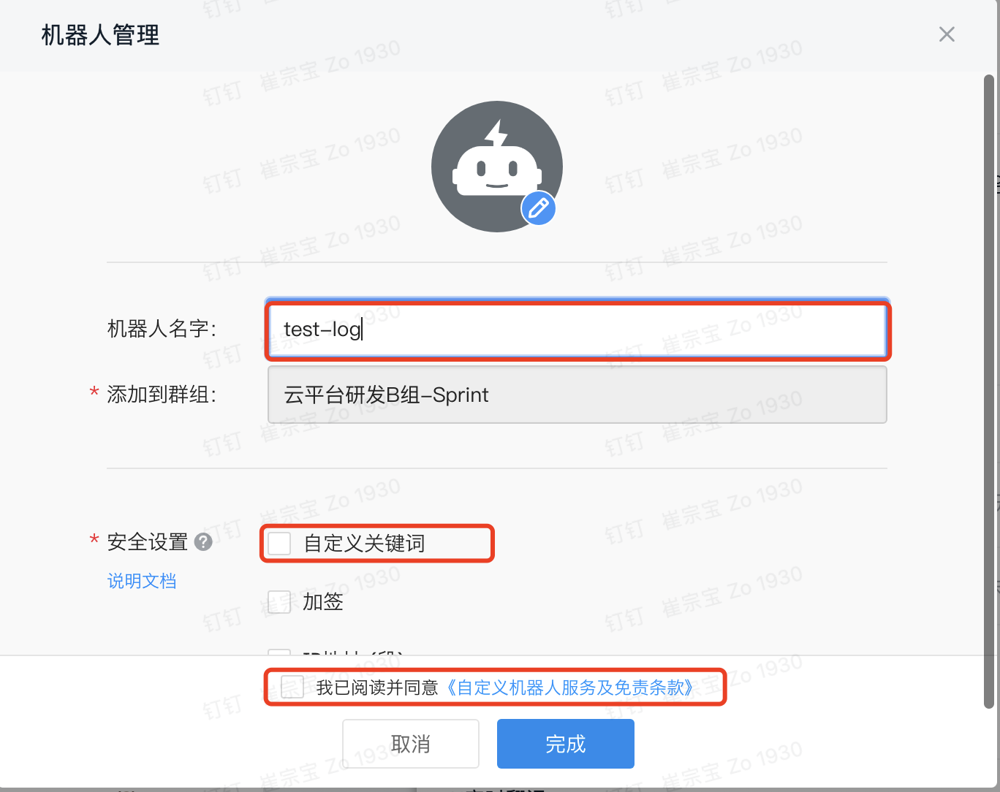

## 事件订阅

### 功能简介

- 事件订阅可以设置钉钉或者其他群的机器人，从而实现消息推送（可以自定义报警，错误等级别的消息）

### 功能介绍

- 位置：系统管理—>项目管理，某一项目的事件订阅按钮

- 添加订阅可分为一下两步：

  1、添加订阅按钮，选择合适的聊天工具作为推送媒介

  

  2、获取订阅地址（以下为钉钉的操作流程）

  
  
  
  
  
  

- 钉钉的设置说明文档：https://open.dingtalk.com/document/org/application-types