## 应用管理

### 创建Bundle应用 starbucks-website

进入”应用管理“， 点击 ”New App“

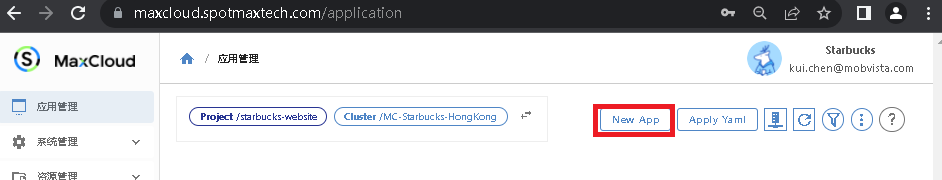

输入相应的设置

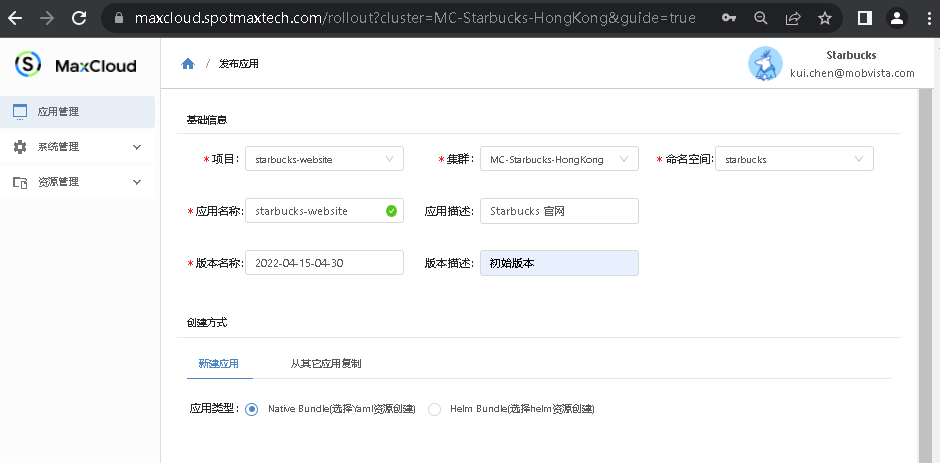

点击右下角的按钮

如果已经部署了k8s资源， 可以在创建bundle时， 把相应的资源加入到bundle中进行管理

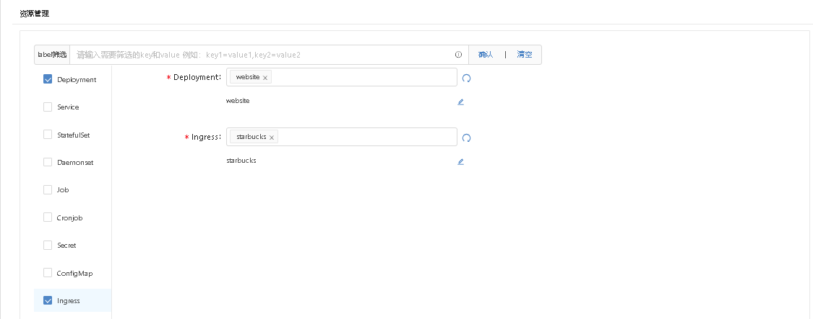

### 创建相应的k8s部署

为了使Starbucks网站能正常工作， 我们需要

- 创建Deployment启动starbucks的网站镜像
进入 ”资源管理“ ->”Deployment“

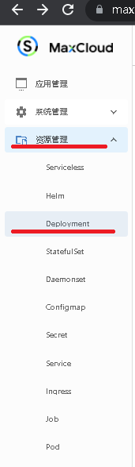

点击 "YAML部署"

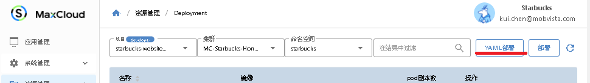

填入相应的k8s部署文档， 并点击”预检查“

```
# k8s 部署文档示例
apiVersion: apps/v1
kind: Deployment
metadata:
  name: website
  namespace: starbucks
spec:
  selector:
    matchLabels:
      app: website
  template:
    metadata:
      labels:
        app: website
      name: website
    spec:
      containers:
        - image: 'spotmax/starbucks:v0.0.4'
          name: website
          ports:
            - containerPort: 80
              protocol: TCP

```

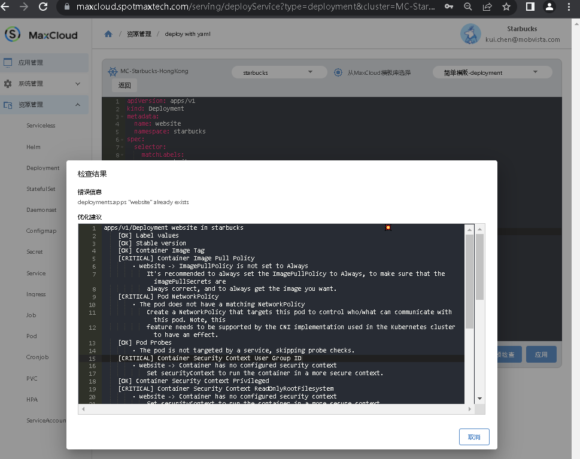

修复可能的问题后点击 ”应用“， 我们的网站就运行起来了。 

- 创建 Service资源控制负载均衡

进入 ”资源管理“ ->”Service“ 填入k8s service配置，点击 ”应用“

```
apiVersion: v1
kind: Service
metadata:
  name: website
spec:
  externalTrafficPolicy: Cluster
  ports:
      port: 80
      protocol: TCP
      targetPort: 80
  selector:
    app: website
```

- 创建Ingress资源，使用域名访问Starbucks网站

进入 ”资源管理“ ->”Ingress“ 填入k8s ingress配置，点击 ”应用“

```
apiVersion: networking.k8s.io/v1
kind: Ingress
metadata:
  name: starbucks
spec:
  rules:
    - host: starbucks.spotmaxtech.com
      http:
        paths:
          - backend:
              service:
                name: starbucks
                port:
                  number: 80
            path: /
            pathType: Prefix
  tls:
    - hosts:
        - starbucks.spotmaxtech.com
      secretName: spotmaxtech-secret
```

### 资源加入Bundle

进入”应用个管理“， 找到Website bundle 点击 ”Upgrade“

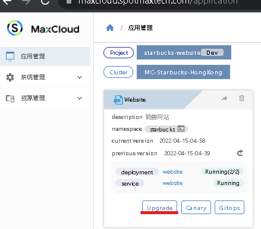

把上面创建的Deployment，Service， Ingress 加入到当前bundle， 并点击”Apply“按钮

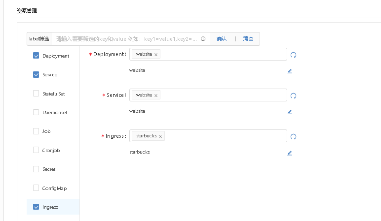

点击“Upgrade”按钮， 填入新版本信息，创建新版本来记录当前Deployment和Service等资源的状态。

现在访问已部署的服务，就可以看到Starbucks Website已经运行起来了。目前运行的是产品第一期，即展示咖啡饮品。

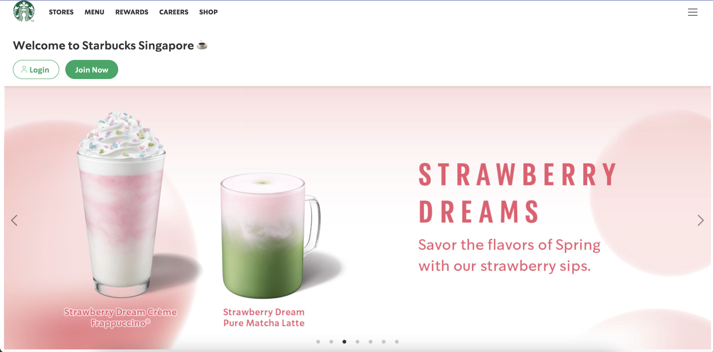

### 使用Startbucks bundle进行灰度发布

进入”应用个管理“， 找到Website bundle 点击 ”Canary“

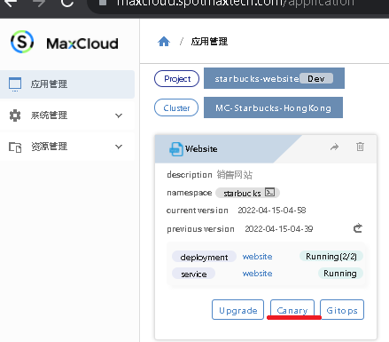

在 ”新建金丝雀“ 界面， 选择需要做灰度发布的资源， 填入pod数量和需要灰度发布的版本号

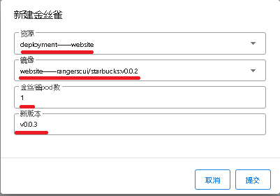


点击”提交“按钮开始灰度测试

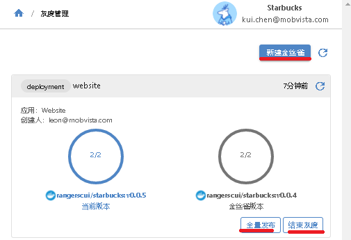

如果当前灰度版本工作正常， 可以点击 “全量发布” 将当前金丝雀版本发布到生产环境

如果当前灰度版本有问题， 可以随时点击“结束灰度” 删除当前金丝雀版本

也可以点击“新建金丝雀”按钮来创建更多的金丝雀版本。 

MaxCloud没有限制金丝雀版本数量， 可以创建多个， 但是操作者需要注意金丝雀发布Pod数量占总体发布Pod数量的比例

用户再次访问服务，即可看到第二期的产品页面，即展示甜品的页面。

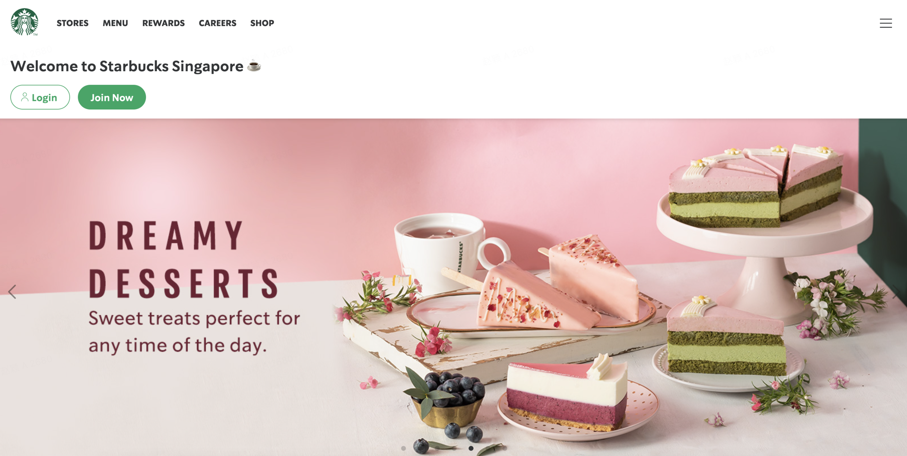

至此，小A和小D就借助MaxCloud完成了一个项目的开发及部署。
