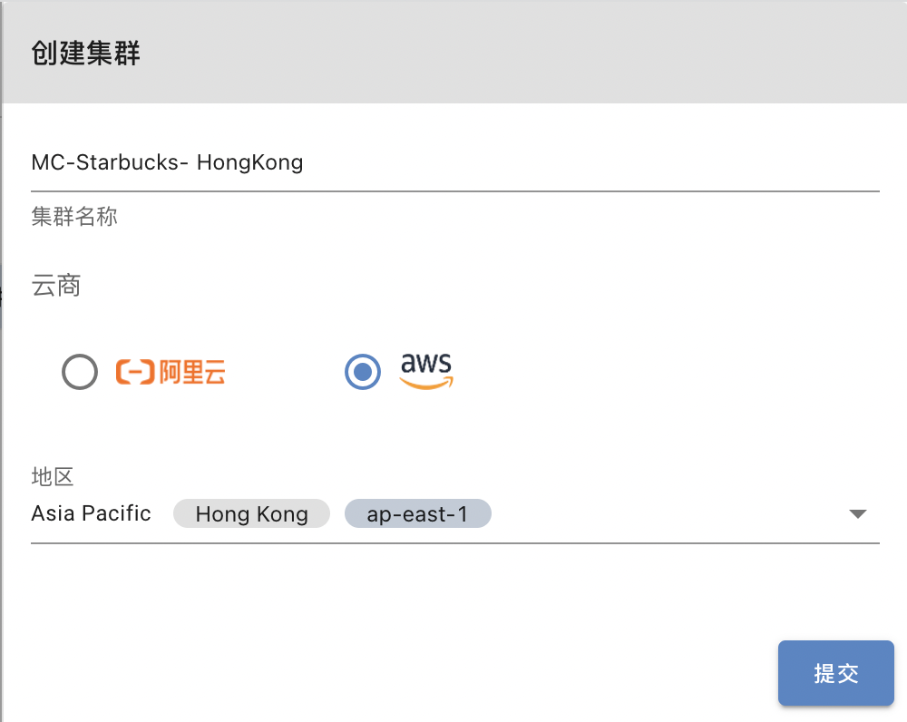
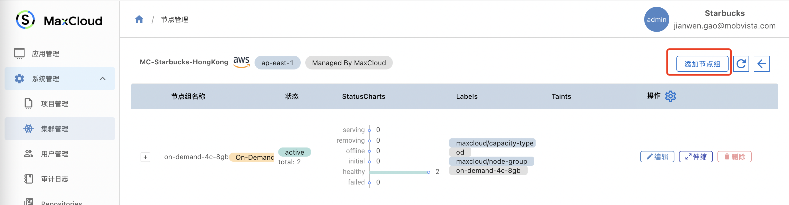

## 集群管理

创建集群的工作由管理员小A来完成，MaxCloud平台支持两种生成集群的方式，一是通过KubeConfig文件Import已有的Kubernetes集群；二是在MaxCloud上面直接创建集群，这里我们以`Create Cluster` 为例，来说明小A如何创建一个开箱即用的K8s集群。

## 路径

系统管理->集群管理->创建集群

## 填写基础信息

您只需填写非常简单的信息就可以创建出一个k8s集群。

1. 填写集群名称
2. 选择云商
3. 选择地区

如下图所示：

创建成功的集群在集群列表中会有`Managed By MaxCloud`标识

## 创建节点组

集群创建成功后再集群列表页面，点击`节点管理`,进入节点列表管理页面后点击添加节点组

填写节点组信息

1. 节点组名称
2. 选择节点实例类型
3. 选择节点硬件配置

到这里为止，管理员小A的工作就完成了，接下来开发人员小D就可以进行应用部署了。

