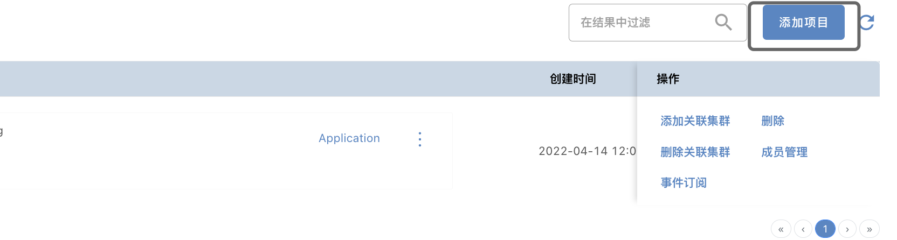
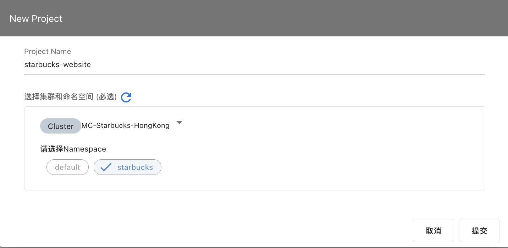
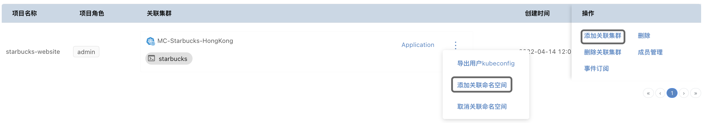
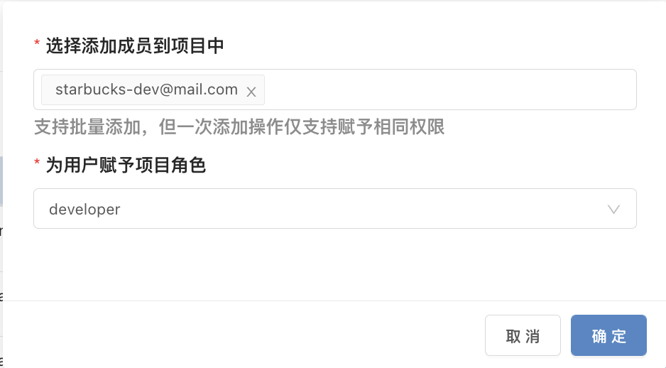

## 项目管理

### 创建项目

创建项目的工作由管理员小A来完成. 选择`系统管理`—>`添加项目`, 输入项目名称`starbucks-website	`, 并同时添加关联集群和指定命名空间。

关于如何导入/创建集群请查看[集群管理](clusterManagement.md)。

用户完成项目的创建后，可以继续为项目添加关联集群，或者为已有集群添加命名空间，方式见下图。

- 成员管理

  管理可以参与这个项目的用户, 如果管理员小A在邀请小D加入团队时，没有给小D分配项目及权限，也可以在这里将小D加入到项目中，并给小D分配项目角色为Developer。
  

至此，管理员小A就完成了一个项目的创建工作。

