## 集群功能介绍

## 集群终端

再集群列表页面点击终端按钮会打开浏览器新窗口进入WebConsole 

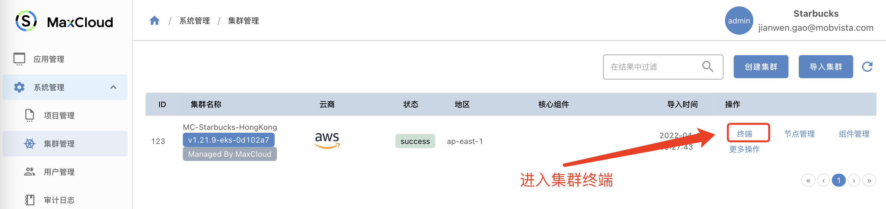

Console环境默认安装了  `kubectl` (可以使用别名 `k`), `kubectx`、`kubens`、`helm` 等命令

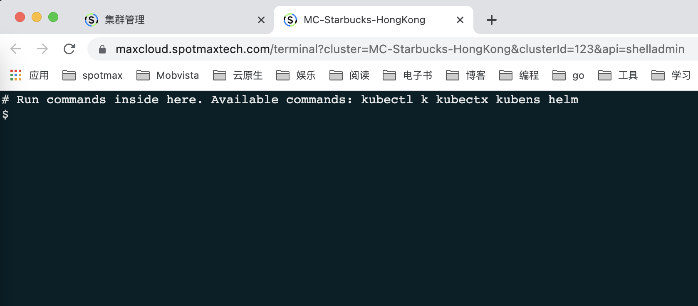

### WebConsole 其他入口

1. 项目页面

   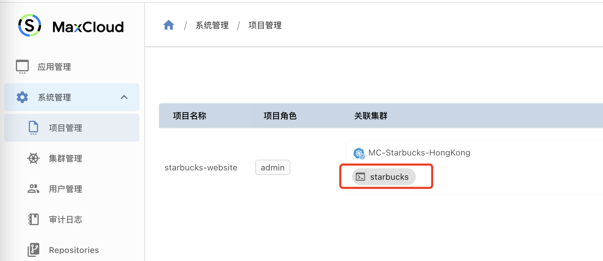

2. Bundle页面

   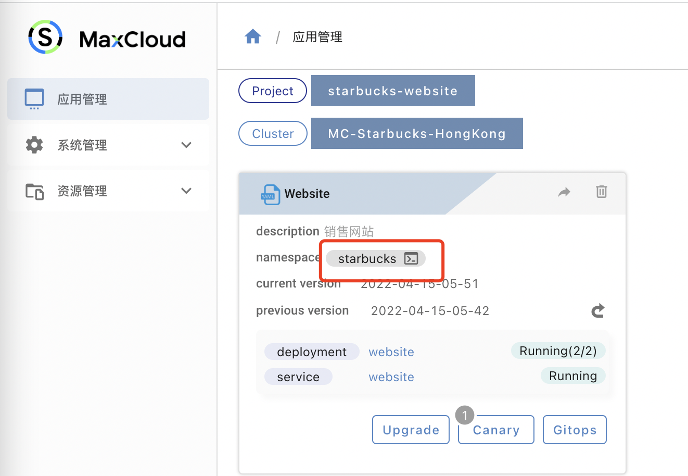

3. Pod列表（exec进入Pod 容器）

   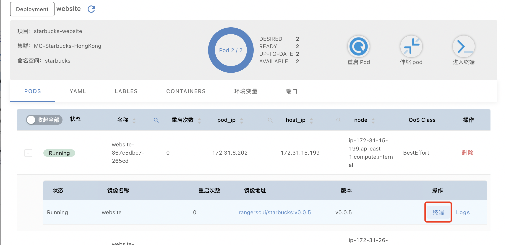

## 命名空间管理

集群列表->更多操作->命名空间

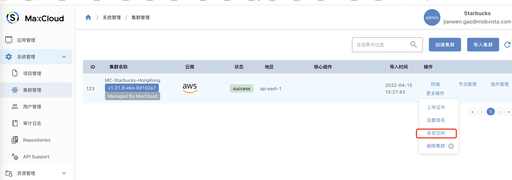

### 管理命名空间

1. 新增命名空间-> 命名空间-> 填写命名空间名称   确定后新建命名空间
2. 删除命名空间

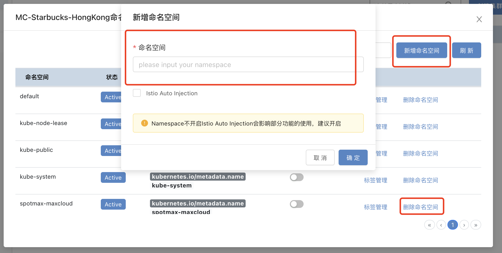

## 组件管理

您可以使用组件管理功能方便的安装监控、日志等组件

集群列表->组件管理

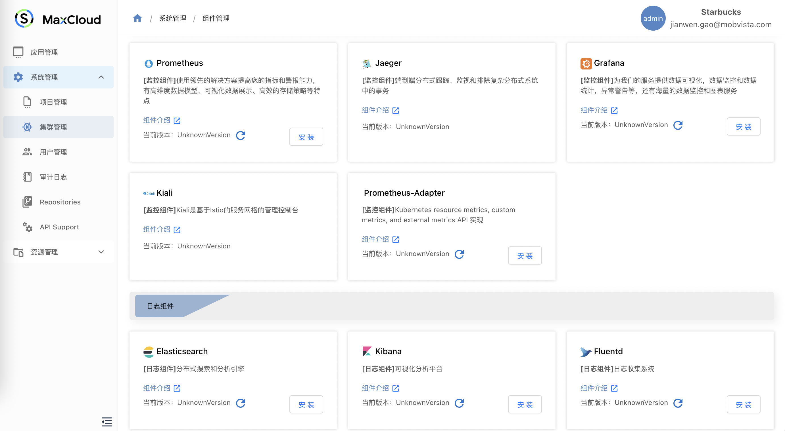

### 安装App

以安装Elasticsearch 为例，您仅需填写7个参数点击确定就可以轻松完成Elasticsearch的安装。

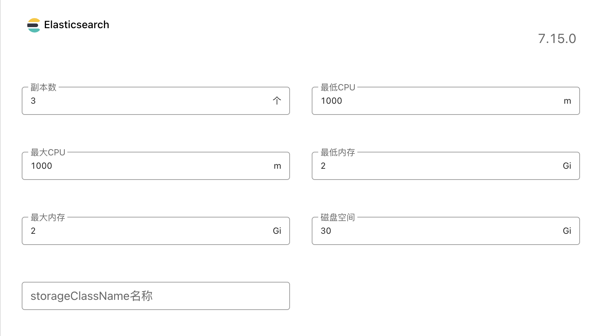

安装完EFK组件后就可以在操作区看到入口

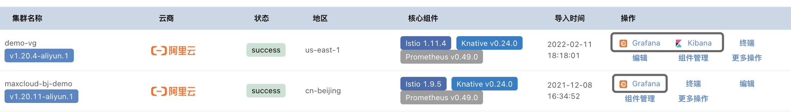

### 集群监控

MaxCloud支持一键安装Grafana、Kibana、Kiali，用户甚至不需要做任何配置，即可从MaxCloud平台获取集群的基础监控信息，开箱即用，对于想了解集群基础运行状况的用户来说，使用MaxCloud自带的监控套件是十分高效便捷的。

#### 使用方式

用户可以直接通过`组件管理`功能安装所需的监控组件，安装成功后，用户直接点击监控组件的入口，即可看到集群和节点的监控信息。安装成功的监控组件示例如下：

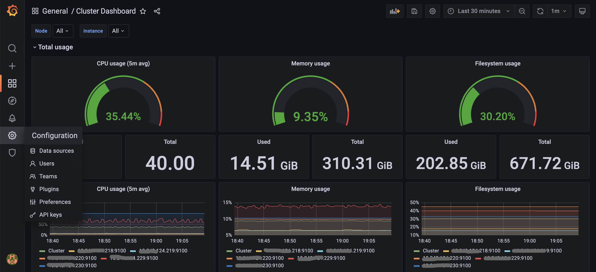

当不再需要组件时，直接卸载即可。

