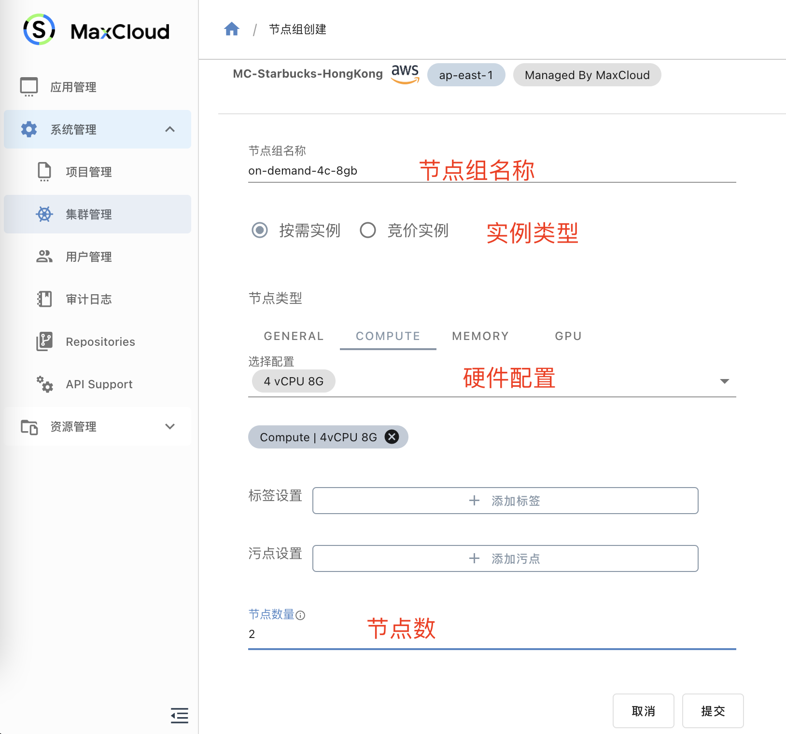

# 创建集群

## 路径

系统管理->集群管理->创建集群

## 填写基础信息

您只需填写非常简单的信息就可以创建出一个k8s集群。

1. 填写集群名称
2. 选择云商
3. 选择地区

如下图所示：

创建成功的集群在集群列表中会有`Managed By MaxCloud`标识

## 创建节点组

集群创建成功后再集群列表页面，点击`节点管理`,进入节点列表管理页面后点击添加节点组

 

填写节点组信息

1. 节点组名称
2. 选择节点实例类型
3. 选择节点硬件配置

