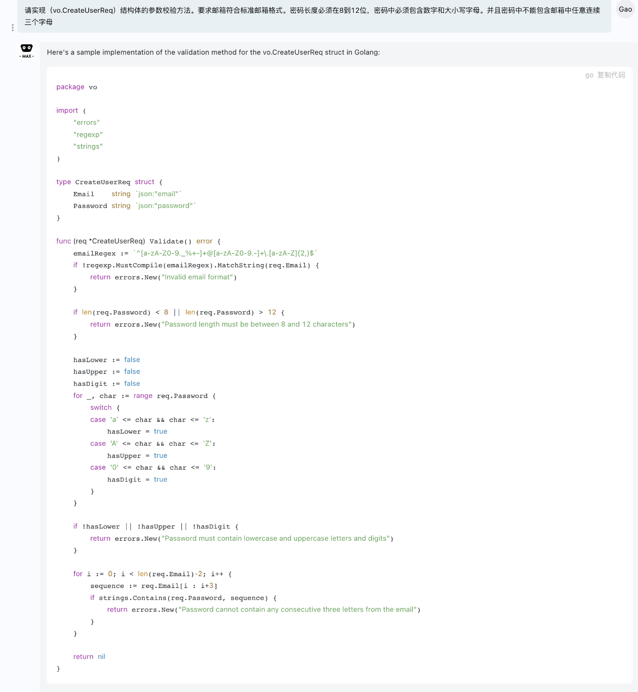

## 简介

MrMax 是MaxCloud团队开发的GPT增强产品，可以自动拆解任务并执行多轮推理。

增强功能：

- 查询实时互联网信息
- 绘制图片
- 设计软件架构图
- 使用客户端分析本地环境中的代码或者数据文件

## 客户端使用指南

### 复制下面代码存放在自己工作电脑上

```python
import socketio
import eventlet
import json
import os
import re
import requests
import getpass
import sys

sio = socketio.Client(reconnection=True, reconnection_attempts=5, reconnection_delay=1, reconnection_delay_max=5)

@sio.event
def connect():
    print("connect success")

@sio.on('authenticated')
def handle_authenticated():
    # 接收服务器返回的 authenticated 事件，并处理响应
    print('Authentication successful')

@sio.on('unauthorized')
def handle_unauthorized():
    # 接收服务器返回的 unauthorized 事件，并处理响应
    print('Authentication failed')
    sio.disconnect()

@sio.event
def message(data):
    print(f'client Received message:【 {data} 】')

@sio.event
def getgodep(data):
    print('client Received getgodep message:', data)
    src_dir = os.getcwd()
    result  = extract_declaration(src_dir, data)
    print(f"extract_declaration result:{result}")
    sio.emit("readcode_response", result)
    eventlet.sleep(0)

@sio.event
def loadfile(data):
    data = data.strip()
    print('client Received loadfile message:', data)
    content = None
    with open(data, 'r') as file:
        content = file.read()
    print(connect)
    sio.emit("readcode_response", content)
    eventlet.sleep(0)

def extract_declaration(src_dir, json_str):
    # Parse the JSON string
    json_data = json.loads(json_str)
    package_name = json_data["package_name"]
    element_name = json_data["element"]
    print(package_name, element_name)
    # Iterate through the source files in the directory
    for root, _, files in os.walk(src_dir):
        for file in files:
            if file.endswith(".go"):
                # Read the file content
                with open(os.path.join(root, file), "r") as f:
                    content = f.read()

                # Check if the package name matches
                package_match = re.search(r"package\s+" + package_name, content)
                if package_match:
                    # Search for the struct/interface declaration
                    element_match = re.search(r"(type\s+" + element_name + r"\s+(?:struct|interface)\s*{[^}]*})", content, re.MULTILINE)
                    if element_match:
                        return element_match.group(1)

    return "Not Found"


login_url = "https://maxcloud-api.spotmaxtech.com/api/login"
bot_url = "https://maxcloud-bot.spotmaxtech.com"

print("欢迎使用MaxCloud智能助手，请登录MaxCloud\n")
email = input("账号：")
password = getpass.getpass('密码：', sys.stdout)


headers = {'content-type': 'application/json'}
data = '{{"email": "{0}", "password": "{1}"}}'.format(email, password)

response = requests.post(login_url, data=data, headers=headers)
if response.status_code != 200:
    print(f"登录失败，请稍后重试。status_code:【{response.status_code}】 ,error_message: 【{response.json()['message']}】")
    sys.exit(1)

print("login success")
token = response.json()['data']['token']


def connect(times):
    try:
        sio.connect(bot_url, headers={'auth': token}, wait_timeout=10)
    except socketio.exceptions.ConnectionError:
        if times == 0:
            print("连接MaxCloud Bot服务失败，请稍后再试")
            sys.exit(1)
        print(f"连接异常断开,即将重试")
        next_times = times - 1
        # 如果失败则重试
        connect(next_times)

connect(5)
```

### 安装依赖包

```python-repl
websocket-client>=1.6.1
simple-websocket>=0.10.1
flask_socketio>=5.3.4
eventlet>=0.33.3
```

### 启动客户端程序

假设上面客户端代码存放目录为 `/Users/maxcloud/workspace/client.py`，您现在正在开发的代码目录为 ``/Users/maxcloud/workspace/maxcloud/``，

现在您就可以在 ``/Users/maxcloud/workspace/maxcloud/``目录中用以下命令启动MrMax客户端程序。

```python
python /Users/maxcloud/workspace/client.py
```

**启动后需要使用MaxCloud账号密码登录,出现connect success说明启动成功，由于服务器是部署在美东，请确保网络畅通。**



