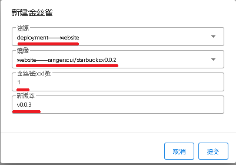

## 使用Startbucks bundle进行灰度发布

进入”应用个管理“， 找到Website bundle 点击 ”Canary“

在 ”新建金丝雀“ 界面， 选择需要做灰度发布的资源， 填入pod数量和需要灰度发布的版本号

点击”提交“按钮开始灰度测试

如果当前灰度版本工作正常， 可以点击 “全量发布” 将当前金丝雀版本发布到生产环境

如果当前灰度版本有问题， 可以随时点击“结束灰度” 删除当前金丝雀版本

也可以点击“新建金丝雀”按钮来创建更多的金丝雀版本。 

MaxCloud没有限制金丝雀版本数量， 可以创建多个， 但是操作者需要注意金丝雀发布Pod数量占总体发布Pod数量的比例
