## 项目管理

### 项目简介

- 项目需要绑定k8s集群和可用命名空间，以达到资源隔离的目的（多个项目可以共用集群和命名空间MaxCloud不做限制，您需要按照您的业务需求做好资源分配）。

- 一个项目的相关业务尽可能的放到同一项目下（不同业务可以根据namespace区分哦）

### 功能介绍

- 项目列表

  位置：系统管理—>项目管理，用户可查看自己所属的全部项目

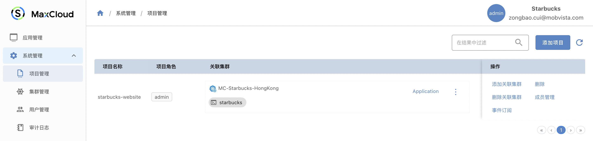

- 添加项目

  您可以按照业务需要添加多个项目。
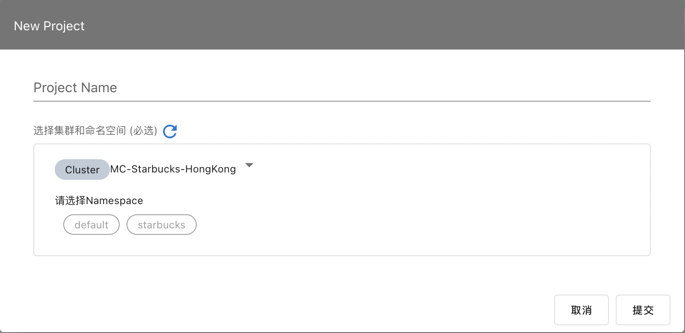

- 添加关联集群

  这里需要导入集群到maxCloud，或者在maxCloud上创建一个集群，（现在我们直接使用已经提供的starbucks集群就ok了）

  一个项目可以关联添加多个集群哦

  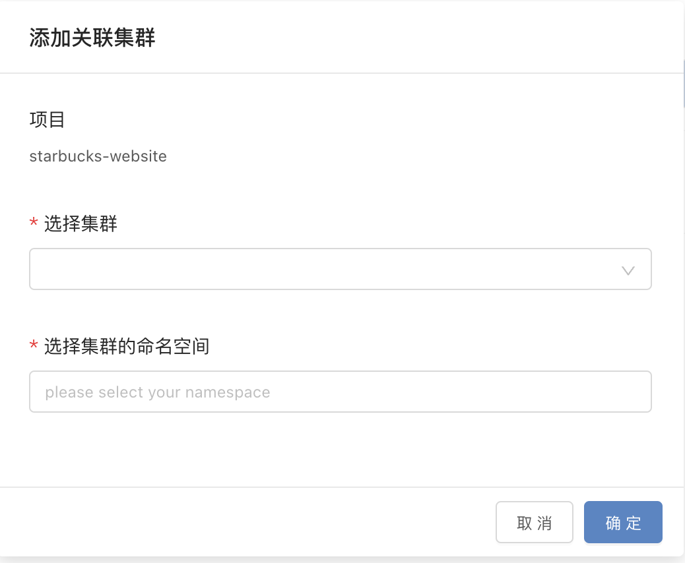

- 添加关联命名空间

 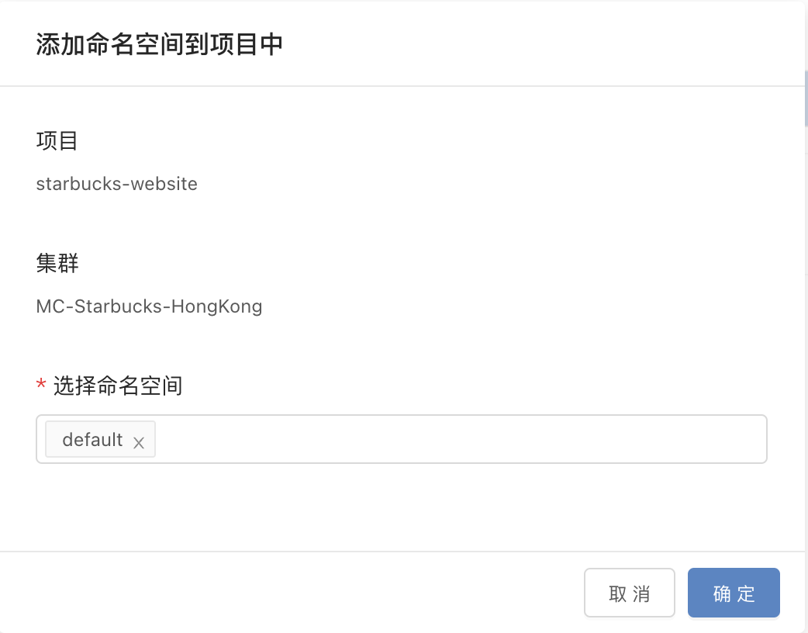

- 取消关联命名空间

 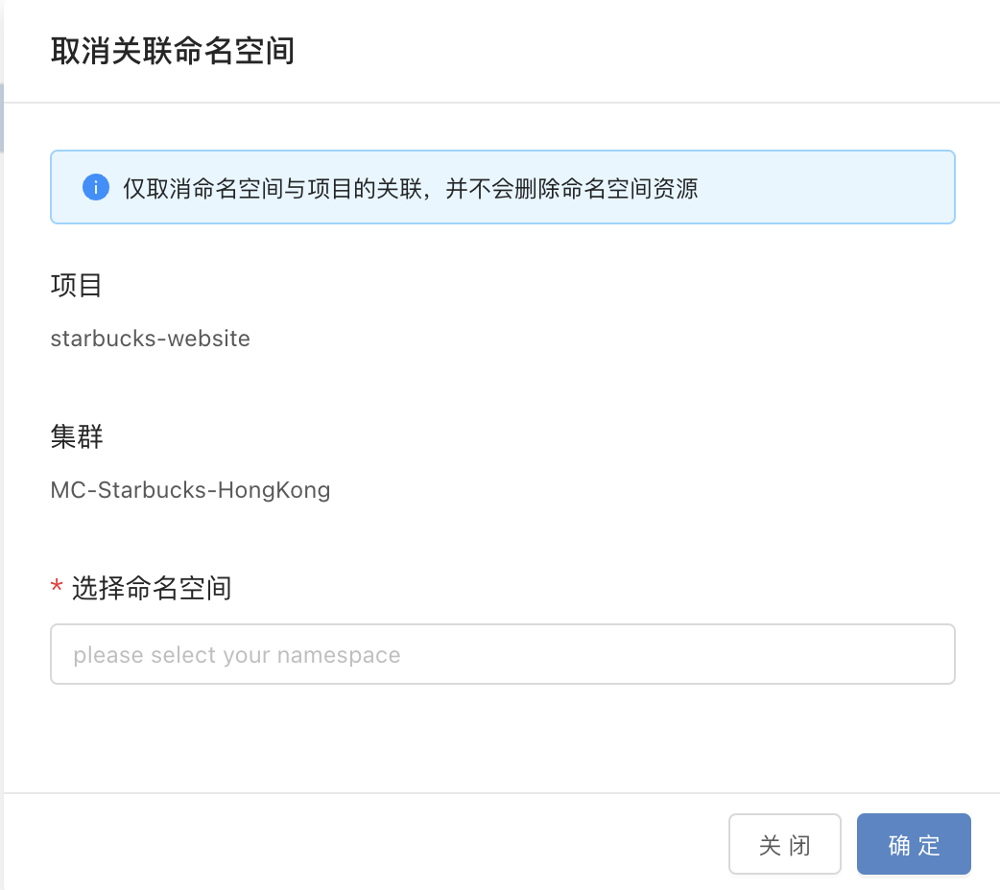

- 进入终端

  直接点击对应的命名空间

  终端里面提供了kubectl、helm、kn 等命令方便您方便管理集群

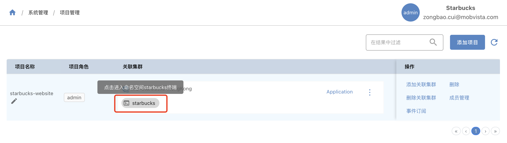

- 导出用户kubeconfig

  导出之后，你就可以在自己本地去管理集群和资源了

  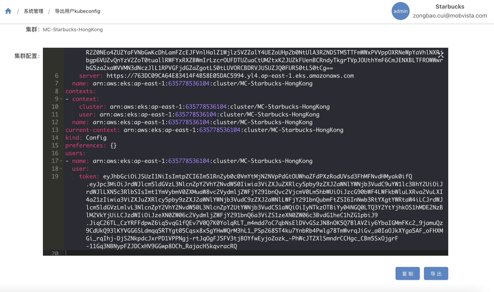

- 删除关联集群

  取消集群和项目的关联，但是不会删除集群中的服务、命名空间等集群资源（删除服务可以在查看服务里面删除，其他资源需要您使用终端手动删除）。

  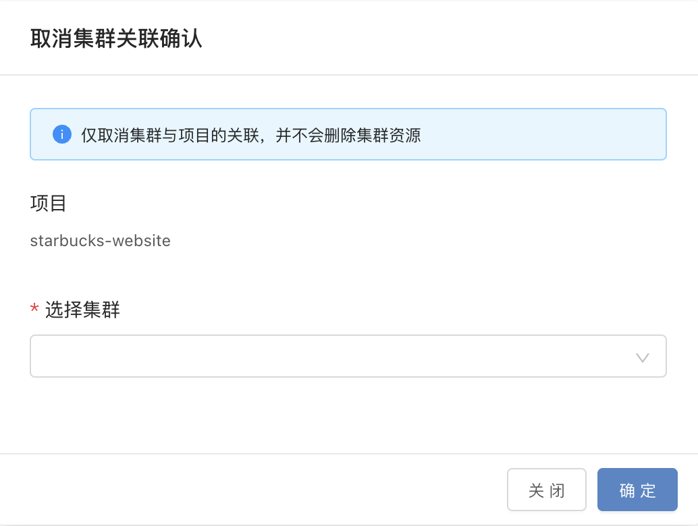

- 成员管理

  管理可以参与这个项目的用户

  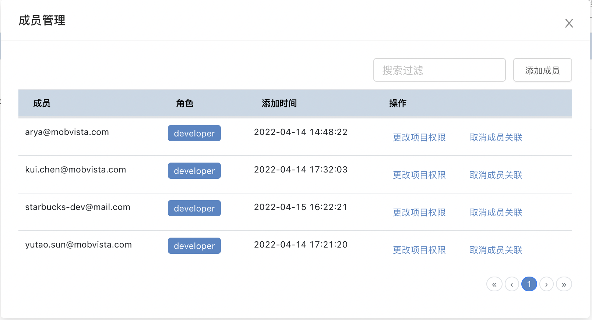
  
  添加成员

  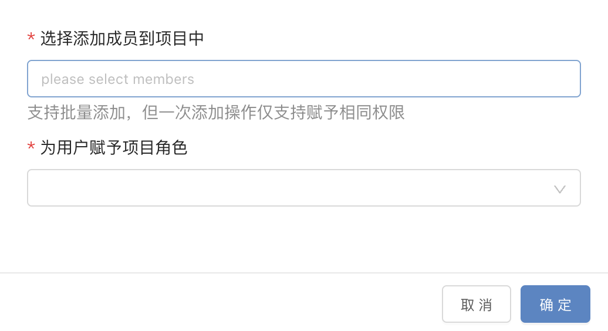

  取消成员

  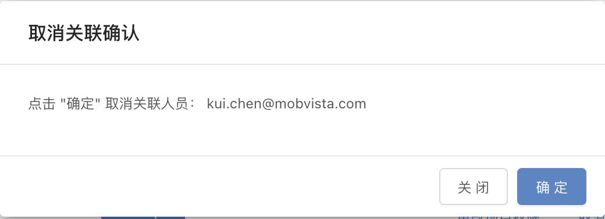

  改变成员权限

  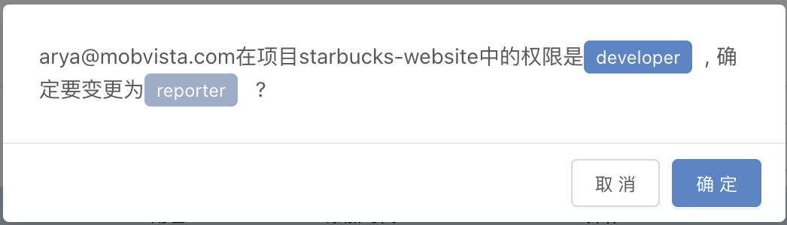

- 删除项目

  删除项目，但是不会删除集群、命名空间、服务等集群资源。

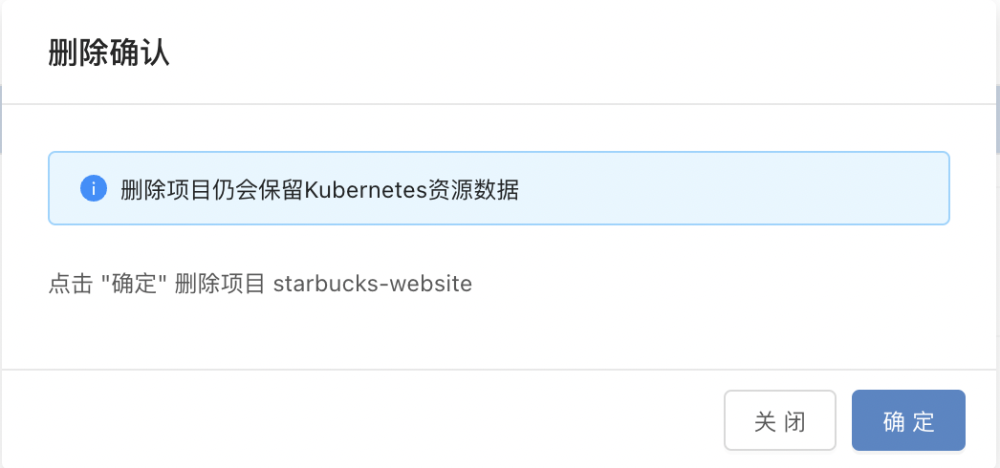

