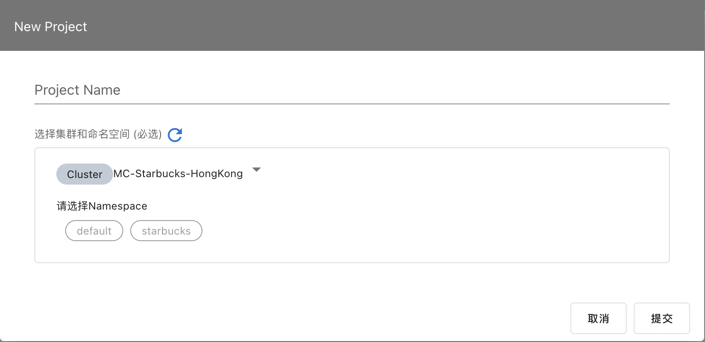
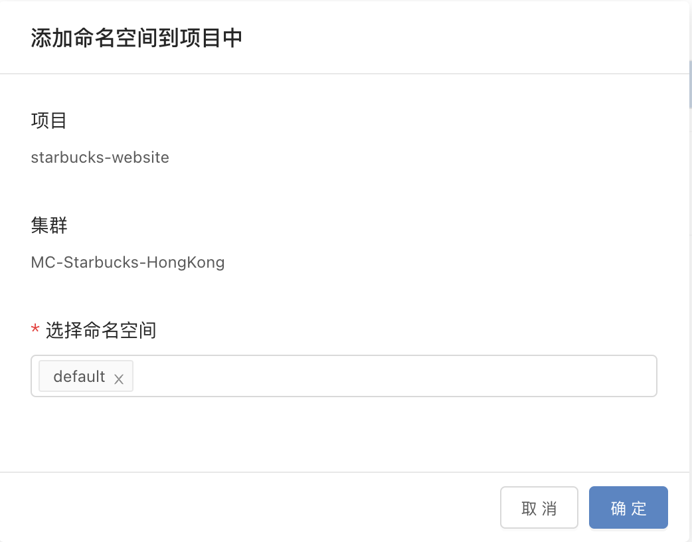
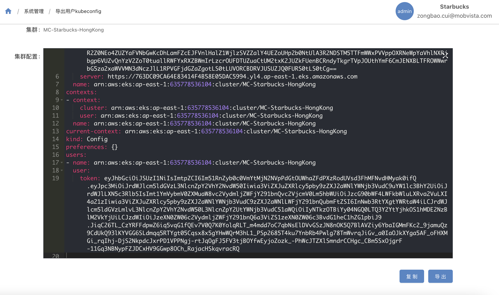
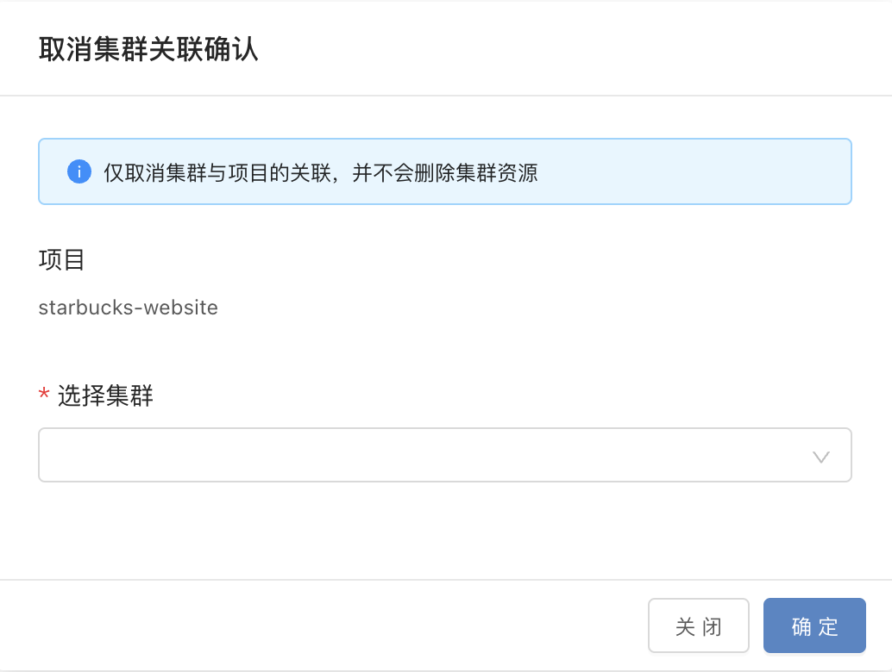
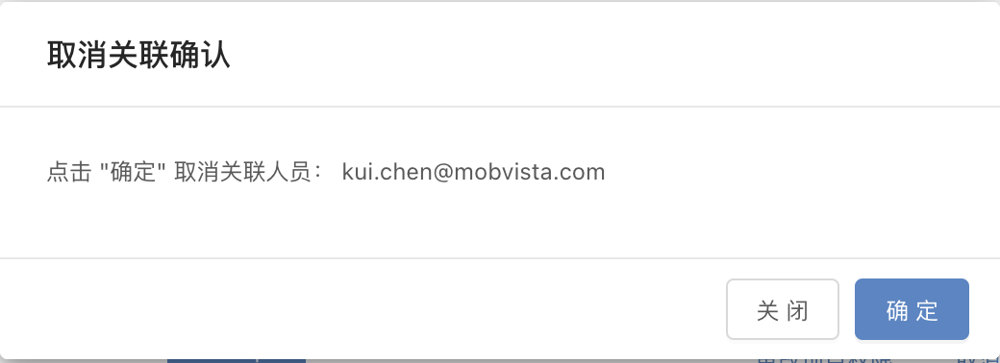
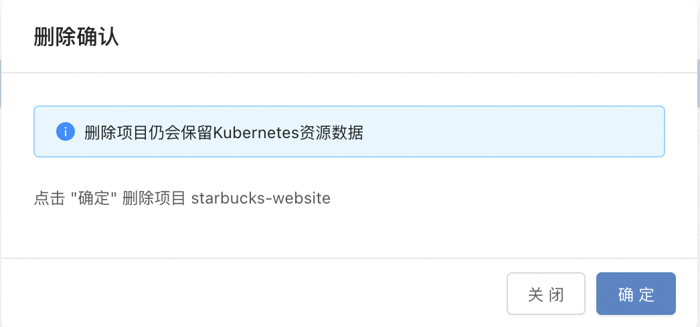

## 项目管理

### 项目简介

- 项目可以是一个微服务组，建议按照业务线划分。
  - 假设贵公司有两个项目 A电商，B社交，这里就需要创建两个项目。
  - A电商项目下有 用户、商品、订单、支付等微服务，就可以在A项目中创建多个微服务。B社交项目同理，按照您的业务分配资源和创建服务
- 按照业务发布流程划分项目
  - 您也可以按开发环境、测试环境、灰度环境、线上环境这样的维度创建多个项目。

- 项目需要绑定k8s集群和可用命名空间，以达到资源隔离的目的（多个项目可以共用集群和命名空间MaxCloud不做限制，您需要按照您的业务需求做好资源分配）。建议每个项目单独一个k8s集群，或者不同的项目使用单独的命名空间。

### 功能介绍

- 项目列表

  位置：系统管理—>项目管理，用户可查看自己所属的全部项目

- 添加项目

  您可以按照业务需要添加多个项目。

- 添加关联集群

  这里需要导入集群到maxCloud，或者在maxCloud上创建一个集群，（现在我们直接使用已经提供的starbucks集群就ok了）

  一个项目可以关联添加多个集群哦

  

- 添加关联命名空间

 

- 取消关联命名空间

 

- 进入终端

  直接点击对应的命名空间

  终端里面提供了kubectl、helm、kn 等命令方便您方便管理集群

- 导出用户kubeconfig

  导出之后，你就可以在自己本地去管理集群和资源了

  

- 删除关联集群

  取消集群和项目的关联，但是不会删除集群中的服务、命名空间等集群资源（删除服务可以在查看服务里面删除，其他资源需要您使用终端手动删除）。

  

- 成员管理

  管理可以参与这个项目的用户

  
  
- 添加成员

  

- 取消成员

  

- 改变成员权限

  

- 删除项目

  删除项目，但是不会删除集群、命名空间、服务等集群资源。

