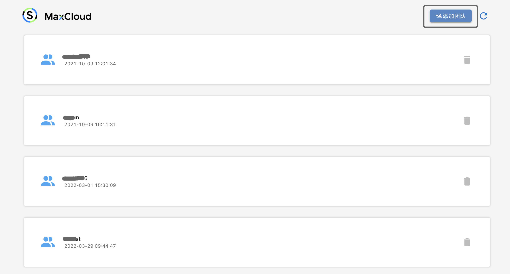
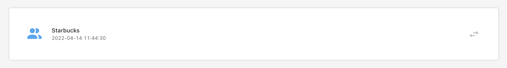
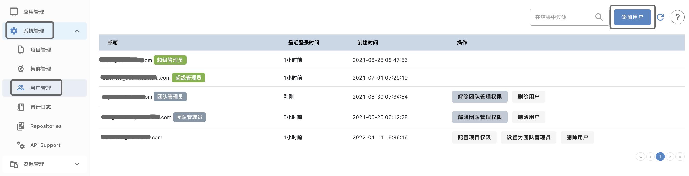
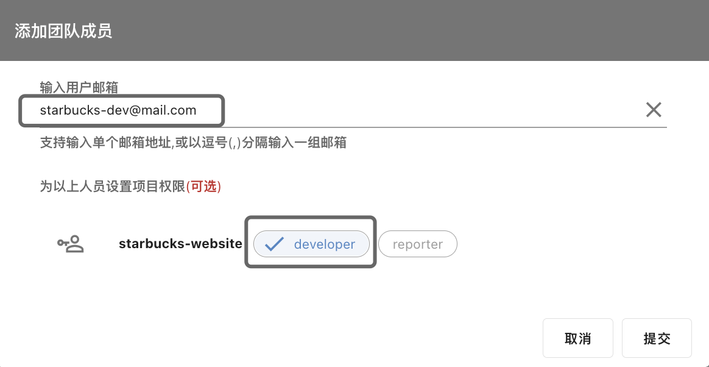

## 团队管理

### 创建团队

团队的创建工作由团队管理员**小A**来完成，操作步骤如下：

选择"添加团队", 输入团队名称`Starbucks`, 点击提交, 即可完成团队的创建工作

提交后可以看到Starbucks团队

### 添加人员

管理员小A需要将研发人员小D加到Starbucks团队中，这项工作需要**小A**在`用户管理`中完成，操作步骤如下：

点击`用户管理`, 选择`添加用户`, 输入研发人员小D的邮箱, `starbucks-dev@mail.com`, 并可以同时将小D分配到`starbucks-website`项目中，给小D分配**developer**的角色

小A点击提交后，小D会在自己的邮箱`starbucks-dev@mail.com`中收到加入`Starbucks`团队的邀请邮件，小D按照邮件中的指示，接受邀请后，即可加入`Starbucks`团队，并同时以**developer**身份加入到`starbucks-website`项目中。

